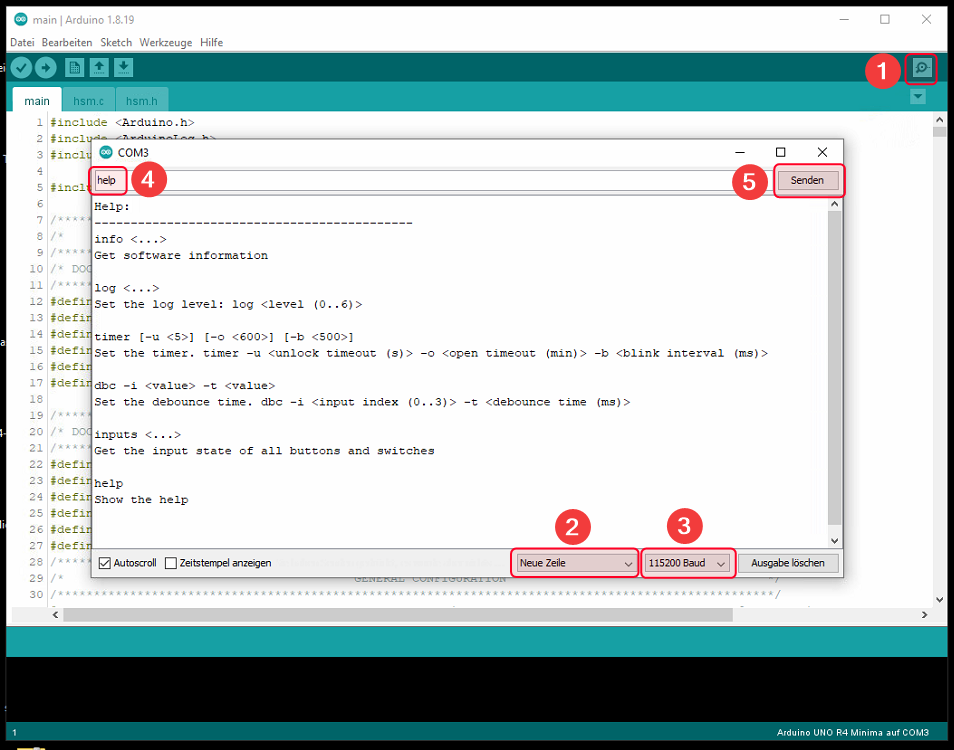
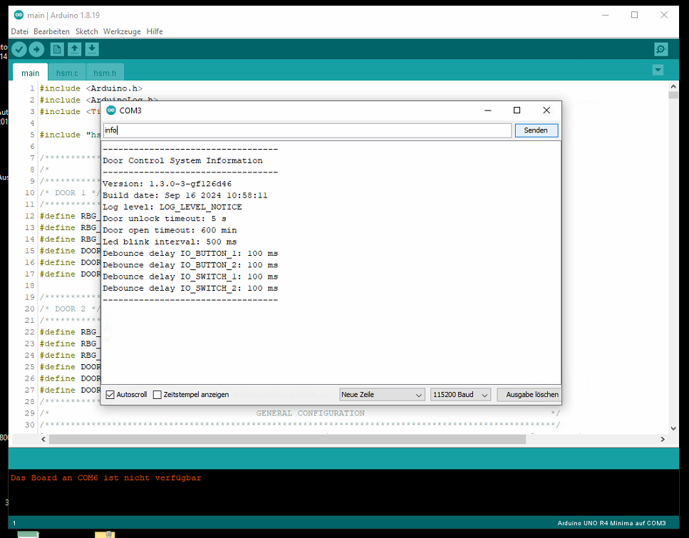
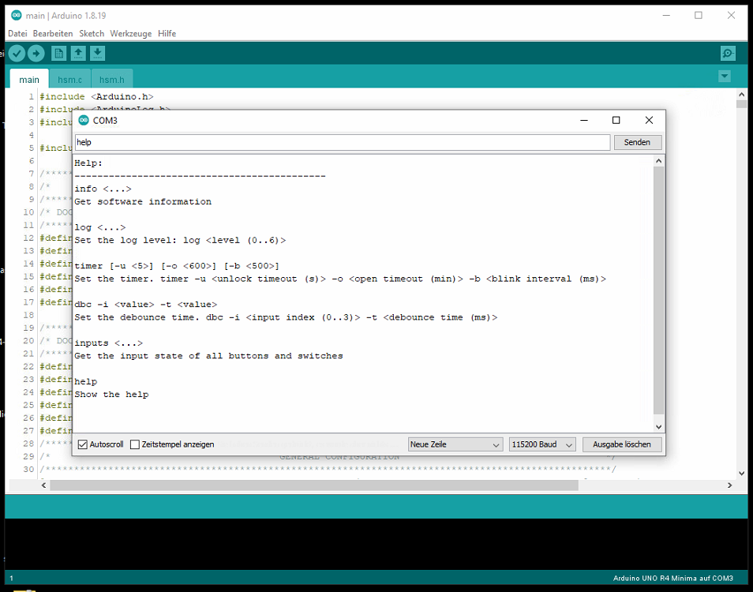
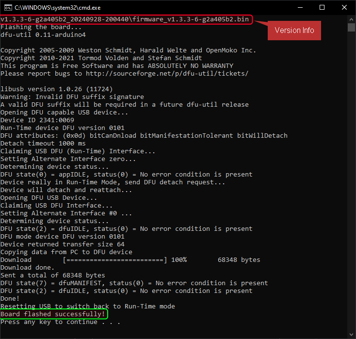

<span style="font-family:Helvetica; font-size:30pt;">Double Door Control System</span>
---

- [Introduction](#introduction)
  - [How It Works](#how-it-works)
  - [Summary of System Behavior](#summary-of-system-behavior)
    - [Main System States](#main-system-states)
    - [Common Events](#common-events)
    - [What Happens in Case of Errors?](#what-happens-in-case-of-errors)
  - [User Tips](#user-tips)
- [Simulation and Testing with Wokwi](#simulation-and-testing-with-wokwi)
    - [How the Simulation Works](#how-the-simulation-works)
- [Schematic Diagram Explanation](#schematic-diagram-explanation)
    - [1. Arduino Mega](#1-arduino-mega)
    - [2. RGB LEDs](#2-rgb-leds)
    - [3. Push Buttons](#3-push-buttons)
    - [4. Relays](#4-relays)
    - [5. Slide Switches](#5-slide-switches)
    - [6. Resistors](#6-resistors)
    - [7. NOT Gates](#7-not-gates)
    - [8. Power and Ground Connections](#8-power-and-ground-connections)
  - [Summary of Operation](#summary-of-operation)
- [Command Line Interface (CLI)](#command-line-interface-cli)
  - [Installation and Setup](#installation-and-setup)
    - [Step 1: Install Arduino IDE](#step-1-install-arduino-ide)
    - [Step 2: Connect Your Device](#step-2-connect-your-device)
    - [Step 3: Open the Serial Monitor](#step-3-open-the-serial-monitor)
  - [Using the Command Line Interface (CLI)](#using-the-command-line-interface-cli)
    - [1. **info** — Get Software Information](#1-info--get-software-information)
    - [2. **log** — Set Log Level](#2-log--set-log-level)
    - [3. **timer** — Set the Timer](#3-timer--set-the-timer)
    - [4. **dbc** — Set Debounce Time](#4-dbc--set-debounce-time)
    - [5. **inputs** — Get Input State](#5-inputs--get-input-state)
    - [6. **help** — Show Help](#6-help--show-help)
    - [Common Errors](#common-errors)
- [Persistence and Memory Storage](#persistence-and-memory-storage)
    - [How It Works](#how-it-works-1)
    - [Example](#example)
    - [Why This Matters](#why-this-matters)
- [Flashing the Board Over USB](#flashing-the-board-over-usb)
    - [Flashing Instructions](#flashing-instructions)
    - [Why Use a Batch Script?](#why-use-a-batch-script)


# Introduction

This Door Control System is designed to control the state of two doors in a way that ensures security and proper operation. The state diagram below outlines how the system moves between different states depending on user actions or events related to the doors.

## How It Works

The system goes through different states based on the status of the doors (whether they are locked, unlocked, open, or closed). These states are triggered by specific events, such as a door being unlocked, opened, or closed. The system uses LEDs to indicate the current state of each door, making it easy to understand what is happening at a glance.

## Summary of System Behavior

1. **Idle** - The system starts by waiting for action. This is indicated by both door leds being white.
2. **Unlock** - The system moves to an "unlocked" state when a door is unlocked. This is indicated by the door led blink in  green (for the open door) and red (for the closed door).
3. **Open** - Once unlocked, if the door is opened, the system moves to an "open" state. his is indicated by the door led blink in  green (for the open door) and red (for the closed door).
4. **Fault** - If something goes wrong (like both doors opening simultaneously), the system moves to a "fault" state. This is indicated by both door leds blinking in magenta.

### Main System States
The statemaching shown below has been implemented using [UML-State-Machine-in-C](https://github.com/kiishor/UML-State-Machine-in-C) by [kiishor](https://github.com/kiishor). Thanks a lot for this nice piece of software!

<div style="text-align: center;">
   
</div>

1. **INIT (Initialization State)**
   The system starts here when it is first turned on. It checks that both doors are initially closed before moving to the next state.

2. **IDLE (Waiting State)**
   Once the doors are closed, the system moves into IDLE, where it waits for further events. From here, the system can respond to several actions, such as unlocking or opening a door.

3. **DOOR_1_UNLOCKED**
   When Door 1 is unlocked, the system transitions to this state. It waits for Door 1 to either open or relock after a timeout.

4. **DOOR_1_OPEN**
   If Door 1 is unlocked and then opened, the system enters this state. Once the door closes, it will return to the IDLE state. If the door remains open for too long, the system will move to a FAULT state.

5. **DOOR_2_UNLOCKED**
   Similar to Door 1, when Door 2 is unlocked, the system moves to this state.  It waits for the door to either open or relock after a timeout.

6. **DOOR_2_OPEN**
   When Door 2 is unlocked and opened, the system transitions here. It will wait for the door to close before returning to the IDLE state. If the door remains open for too long, the system will move to a FAULT state.

7. **FAULT (Error State)**
   If there is an issue, such as both doors being open at the same time, the system moves to the FAULT state. From here, it waits until the issue is resolved (i.e., both doors are closed) before returning to IDLE.

### Common Events

- **EVENT_DOOR_1_UNLOCK / EVENT_DOOR_2_UNLOCK:** These events trigger when either Door 1 or Door 2 is unlocked.
- **EVENT_DOOR_1_OPEN / EVENT_DOOR_2_OPEN:** These events occur when a door is opened.
- **EVENT_DOOR_1_CLOSE / EVENT_DOOR_2_CLOSE:** These events occur when a door is closed.
- **EVENT_DOOR_1_UNLOCK_TIMEOUT / EVENT_DOOR_2_UNLOCK_TIMEOUT:** The system moves back to IDEL state if a door is left unlocked for too long without being opened.
- **EVENT_DOOR_1_OPEN_TIMEOUT / EVENT_DOOR_2_OPEN_TIMEOUT:** If a door is left open for too long, the system moves to FAULT state.

### What Happens in Case of Errors?

If both doors are open at the same time, or if there’s a problem closing the doors, the system will enter the FAULT state. This means there is a potential security issue or malfunction that needs to be resolved. The system will remain in the FAULT state until both doors are properly closed.

## User Tips

- Ensure doors are closed properly to prevent the system from entering the FAULT state.
- The system automatically moves back to IDLE after normal door operations (unlocking and opening).
- In case of issues (FAULT state), check that both doors are closed and wait for the system to return to IDLE.

# Simulation and Testing with Wokwi

The development and testing of this software have been carried out using the **Wokwi Simulator**. Wokwi is an online platform that allows for easy simulation of hardware components, including microcontrollers and sensors, which are essential in building and testing control systems like this one.

### How the Simulation Works

- **Virtual Components**: In the Wokwi simulator, virtual components such as buttons, LEDs, and sensors were used to simulate door events. For example, a button press simulates a door being opened or closed.
- **Real-time Testing**: The simulator allows real-time testing of state transitions without needing the physical hardware. This makes it easier to test the software logic, ensuring that all states, events, and transitions work as expected.
- **Debugging**: Wokwi provides tools to debug the system and observe how it behaves with various inputs, allowing for fine-tuning and improvements in software stability.

If you would like to try the simulation yourself, simply visit [Wokwi - Door Control System](https://wokwi.com/projects/404671162937705473) to load the project.


# Schematic Diagram Explanation

The system consists of two doors, each controlled by relays, buttons, RGB LEDs, and switches connected to an Arduino Mega. The following is a breakdown of each component and its role in the system.

<div style="text-align: center;">
   
</div>

### 1. Arduino Mega
   - **ID**: `mega`
   - **Position**: Center of the circuit.
   - **Role**: The Arduino Mega acts as the central microcontroller, managing the control logic for the doors, buttons, RGB LEDs, and relays. The Mega controls the state transitions based on the input from switches and buttons and provides feedback using the RGB LEDs.
   
### 2. RGB LEDs
   - **RGB1**: 
     - **ID**: `rgb1`, labeled as "test".
     - **Position**: Bottom center, near door 1.
     - **Connections**: Pins 5 (blue), 6 (green), and 7 (red) of the Arduino Mega.
     - **Role**: Indicates the status of Door 1 (e.g., locked, unlocked, open, etc.).
   
   - **RGB2**: 
     - **ID**: `rgb2`
     - **Position**: Top center, near door 2.
     - **Connections**: Pins 11 (blue), 12 (green), and 13 (red) of the Arduino Mega.
     - **Role**: Indicates the status of Door 2 similarly to RGB1.

### 3. Push Buttons
   - **Button 1 (Tür1)**:
     - **ID**: `btn1`, labeled as "Tür1".
     - **Position**: Bottom right.
     - **Connections**: Connected to pin 2 on the Mega.
     - **Role**: Simulates a door open/close command for Door 1.

   - **Button 2 (Tür2)**:
     - **ID**: `btn2`, labeled as "Tür2".
     - **Position**: Top right.
     - **Connections**: Connected to pin 10 on the Mega.
     - **Role**: Simulates a door open/close command for Door 2.

### 4. Relays
   - **Relay 1**:
     - **ID**: `relay1`
     - **Position**: Top center, near door 2.
     - **Connections**: Connected to NOT gate (`not2`) output, which is controlled by pin 8 of the Arduino.
     - **Role**: Controls the lock/unlock state of Door 2 based on the signal from the NOT gate.
   
   - **Relay 2**:
     - **ID**: `relay2`
     - **Position**: Bottom center, near door 1.
     - **Connections**: Connected to NOT gate (`not1`) output, which is controlled by pin 4 of the Arduino.
     - **Role**: Controls the lock/unlock state of Door 1 based on the signal from the NOT gate.

### 5. Slide Switches
   - **Switch 1**:
     - **ID**: `sw1`
     - **Position**: Top left.
     - **Connections**: Connected to pin 9 of the Arduino Mega.
     - **Role**: This switch provides a manual override for Door 1, allowing it to remain open or closed based on user input.

   - **Switch 2**:
     - **ID**: `sw2`
     - **Position**: Middle left.
     - **Connections**: Connected to pin 3 of the Arduino Mega.
     - **Role**: Similar to Switch 1, this switch provides a manual override for Door 2.

### 6. Resistors
   - Several resistors (`r2`, `r3`, `r4`, etc.) are used throughout the circuit, primarily to limit current and protect the components. Resistor values are listed (1000Ω, 10000Ω) and are connected in series with the buttons, LEDs, and relays.

### 7. NOT Gates
   - **NOT Gate 1 (`not1`)**:
     - **ID**: `not1`
     - **Position**: Bottom center.
     - **Connections**: Receives input from pin 4 on the Mega and outputs to Relay 2.
     - **Role**: Inverts the signal from the Arduino before sending it to the relay, controlling Door 1’s state.

   - **NOT Gate 2 (`not2`)**:
     - **ID**: `not2`
     - **Position**: Top center.
     - **Connections**: Receives input from pin 8 on the Mega and outputs to Relay 1.
     - **Role**: Inverts the signal from the Arduino before sending it to the relay, controlling Door 2’s state.

### 8. Power and Ground Connections
   - **VCC and GND**: Multiple VCC and GND connections are used throughout the circuit to provide power to the components. Components like the Arduino, relays, switches, and RGB LEDs are connected to VCC (5V) and GND to ensure they operate correctly.


## Summary of Operation

This system controls two doors (Tür1 and Tür2) with the following components:
- **Buttons** to open and close the doors.
- **Relays** to lock and unlock the doors.
- **RGB LEDs** to provide visual feedback about each door’s state.
- **Switches** for manual door overrides.
- **NOT gates** to invert signals controlling the relays.

When a button is pressed, the corresponding RGB LED indicates the status of the door, and the relay either locks or unlocks the door. The switches allow for manual overrides, and the relays are controlled by the Arduino Mega, which receives inputs from the buttons, switches, and processes commands.

# Command Line Interface (CLI)

This section will guide you through installing the required software and using the command line interface (CLI) to control the following features (with its default value) of the system. No prior knowledge of computers or IT is required.

- **Log Level:** LOG_LEVEL_NOTICE
- **Door unlock timeout:** 5 seconds
- **Door open timeout:** 10 minutes
- **LED blink interval:** 500 milliseconds
- **Debounce delay:**
  - Door Button 1: 100 mmillisecondss
  - Door Button 2: 100 milliseconds
  - Door Switch 1: 100 milliseconds
  - Door Switch 2: 100 milliseconds

## Installation and Setup

### Step 1: Install Arduino IDE

To operate the CLI, you'll need to install the **Arduino IDE**. This software allows you to communicate with the system using a **Serial Monitor**.

Follow these steps to install Arduino IDE:

1. **Download the Arduino IDE:**
   - Visit the official [Arduino website](https://www.arduino.cc/en/software) and download the version for your operating system (Windows, macOS, or Linux).

2. **Install the Arduino IDE:**
   - Once the download is complete, follow the installation steps for your operating system:
     - On **Windows**: Double-click the installer file (`.exe`) and follow the on-screen instructions.
     - On **macOS**: Open the downloaded `.dmg` file and drag the Arduino icon to the Applications folder.
     - On **Linux**: Extract the downloaded archive and follow the installation instructions provided on the Arduino website.

3. **Launch Arduino IDE:**
   - After installation, open the **Arduino IDE** by double-clicking the icon.

---

### Step 2: Connect Your Device

1. **Connect Your Device to the Computer:**
   - Use a USB cable to connect your hardware (UNO R4 Minima board) to your computer. The hardware is where the CLI will run.

2. **Select the Board:**
   - In the Arduino IDE, go to **Tools > Board** and select **UNO R4 Minima** board from the list.

3. **Select the Port:**
   - Go to **Tools > Port** and select the port to which the **UNO R4 Minima** is connected.

<div style="text-align: center;">
   
</div>

---

### Step 3: Open the Serial Monitor

Once the Arduino IDE is set up, the **Serial Monitor** will allow you to interact with the CLI. Follow these steps to open it:

1. **Open the Serial Monitor:**
   - In the Arduino IDE, click on the **magnifying glass** icon in the top right or navigate to **Tools > Serial Monitor**.

2. **Set the Baud Rate:**
   - In the Serial Monitor, set the **baud rate** to be **115200** (this ensures that the system and the Serial Monitor communicate at the same speed).

3. **Select "Newline" Option:**
   - In the Serial Monitor, set the dropdown option to **CR+LF** (Carriage Return + Line Feed). This ensures that the system recognizes the end of each command.

4. **Now you're ready to use the CLI!**
   - You can type commands into the Serial Monitor and see the system's responses.

<div style="text-align: center;">
   
</div>

---

## Using the Command Line Interface (CLI)

The following commands are available. Simply type the command into the Serial Monitor and press **Enter** to execute it.

### 1. **info** — Get Software Information
Use this command to see information about the software.
- **Command:** `info`

**Example:**
```
info
```

**Output:**
```
----------------------------------
Door Control System Information   
----------------------------------
Version: 1.2.3-63-gb36a76e
Build date: Sep 14 2024 15:02:31
Log level: LOG_LEVEL_NOTICE
Door unlock timeout: 30 s
Door open timeout: 18 min
Led blink interval: 180 ms
Debounce delay IO_BUTTON_1: 100 ms
Debounce delay IO_BUTTON_2: 100 ms
Debounce delay IO_SWITCH_1: 100 ms
Debounce delay IO_SWITCH_2: 100 ms
----------------------------------
```

<div style="text-align: center;">
   
</div>

### 2. **log** — Set Log Level
Use this command to set the "log level," which controls the amount of information recorded by the software. The log level can be set to a number between 0 and 6.
- **Command:** `log <level>`

Where `<level>` can be:
- 0: No logs (silent)
- 1: Fatal errors only
- 2: Errors
- 3: Warnings
- 4: Notices
- 5: Trace
- 6: Verbose (this will show all available logs and shall be used for the purpose of debugging/analytics)

**Example: Set log level to 6 (Verbose)**
```
log 6
```

<div style="text-align: center;">
   
</div>

### 3. **timer** — Set the Timer
This command allows you to set different timers that control how the software behaves in certain situations.
- **Command:** `timer -u <unlock timeout> -o <open timeout> -b <blink interval>`

Where:
- `<unlock timeout>` is the time (in seconds) before a door unlocks.
- `<open timeout>` is the time (in minutes) before a door stays open.
- `<blink interval>` is the time (in milliseconds) between LED blinks.

**Example: Set unlock timeout to 5 seconds, open timeout to 2 minutes, and blink interval to 500 milliseconds**
```
timer -u 5 -o 2 -b 500
```

<div style="text-align: center;">
   
</div>

### 4. **dbc** — Set Debounce Time
This command sets the "debounce" time for inputs (such as buttons). Debounce time ensures that accidental multiple presses are ignored.
- **Command:** `dbc -i <input index> -t <debounce time>`

Where:
- `<input index>` is the number of the input (from 0 to 3).
    - 0: Door Button 1
    - 1: Door Button 2
    - 2: Door Switch 1
    - 3: Door Switch 2
- `<debounce time>` is the time (in milliseconds) for which the input should be stable.

**Example: Set debounce time for door button 1 to 200 milliseconds**
```
dbc -i 1 -t 200
```

<div style="text-align: center;">
   
</div>

### 5. **inputs** — Get Input State
This command shows the current state of all inputs (like buttons or switches).
- **Command:** `inputs`

**Example: Get input state for all inputs**
```
inputs
```

<div style="text-align: center;">
   
</div>

### 6. **help** — Show Help
If you need to see all the available commands and what they do, use this command.
- **Command:** `help`

**Example:**
```
help
```

**Output:**
```
Help:
--------------------------------------------
info <...>
Get software information

log <...>
Set the log level: log <level (0..6)>

timer [-u <5>] [-o <600>] [-b <500>]
Set the timer. timer -u <unlock timeout (s)> -o <open timeout (min)> -b <blink interval (ms)>

dbc -i <value> -t <value>
Set the debounce time. dbc -i <input index (0..3)> -t <debounce time (ms)>

inputs <...>
Get the input state of all buttons and switches

help
Show the help
```

<div style="text-align: center;">
   
</div>

### Common Errors
If you enter a command incorrectly, the system will display an error message. Double-check your spelling and make sure you include all the necessary arguments (e.g., numbers or letters that go with the command).

**Example: Entering an incorrect command**
```
I: comLineIf_cmdErrorCb: Command not found at 'fd'
I: Available commands:

info <...>
Get software information

log <...>
Set the log level: log <level (0..6)>

timer [-u <5>] [-o <600>] [-b <500>]
Set the timer. timer -u <unlock timeout (s)> -o <open timeout (min)> -b <blink interval (ms)>

dbc -i <value> -t <value>
Set the debounce time. dbc -i <input index (0..3)> -t <debounce time (ms)>

inputs <...>
Get the input state of all buttons and switches

help
Show the help
```

# Persistence and Memory Storage

To ensure the system settings are retained between power cycles, the Door Control System uses **EEPROM** (Electrically Erasable Programmable Read-Only Memory) to store configuration settings. This persistence mechanism makes sure that any changes made through the command-line interface (CLI) are not lost when the system is restarted or powered off.

### How It Works

- **Saving Settings**: When a setting is modified using the CLI, the system automatically saves the new setting into the internal EEPROM. This ensures that the new configuration is preserved even after the system is rebooted.
  
- **Loading Settings**: Upon each system startup (or reboot), the system will check if settings have been saved in the EEPROM. If settings exist, they are loaded automatically, ensuring that the system resumes with the same configuration as before the restart.

### Example

- **Scenario**: If you unlock Door 1 and adjust the unlocking timeout via the CLI, this new timeout value will be stored in EEPROM.
- **Next Boot**: When the system is restarted, it will load the adjusted timeout value, meaning you don’t have to reconfigure it manually.

### Why This Matters

The use of EEPROM allows the system to be **configured and fine-tuned on-site without the need for reprogramming**. This means that technicians or operators can easily adjust system settings (such as door timeout values, behavior after unlocking, etc.) directly via the CLI. Once these settings are saved to EEPROM, the system will retain them even after a reboot, making it highly adaptable for different environments or requirements.

This eliminates the need to alter the code or reflash the system when operational changes are required. As a result, maintenance, configuration, and system updates become faster and more convenient, significantly reducing downtime and technical overhead.


# Flashing the Board Over USB

Flashing the Door Control System to the hardware can be done over USB using a simple batch script that will be provided by the software team/owner. This script automates the process of loading the compiled firmware onto the board, making it quick and easy to update the system without needing detailed knowledge of the underlying programming.

### Flashing Instructions

1. **Obtain the software release**: You will receive a software release package named like `v1.2.3-0-g1a2b3c4_20241224_121212.zip` from the software team. This package contains the following items:
   - `firmware_v1.2.3-0-g1a2b3c4.bin`: Compiled firmware binary for the Door Control System.
   - `program_board.bat`: Batch script file for flashing the firmware to the board over USB.
   - `platformio.ini`: The platform specific configuration file that is required by the batch script.
   - `docs`: Documentation folder containing manual, software description, and other relevant information in english and german.

2. **Connect the Board**: Plug the hardware board into your computer via a USB cable. Ensure that the board is powered on and detected by your computer as shonw in the device manager below. In case the board is not detected, you may need to install the USB drivers `renesas_drivers.zip` provided by with the software release package.

<div style="text-align: center;">
   
</div>

3. **Run the Batch Script**:
   - Extract release package contents to a folder on your computer.
   - Locate the `program_board.bat` script inside the extracted folder.
   - Double-click on the batch file to execute it.
   - The script will automatically find the correct port, upload the firmware, and flash the board.

4. **Wait for the Flash to Complete**: The script will display progress information in the terminal window, indicating when the flash process starts and finishes. Once completed, the system will be ready to use with the newly flashed firmware as shown below.

<div style="text-align: center;">
   
</div>

5. **Verify the Software Version**:
   - After flashing, connect to the system’s command-line interface (CLI).
   - Run the command `info` to display the current software version.
   - Compare the displayed version against the version supplied by the software team to ensure the correct firmware has been installed.

   **Example Output:**
   ```
   ----------------------------------
   Door Control System Information   
   ----------------------------------
   Version: 1.2.3-0-g1a2b3c4
   Build date: Sep 14 2024 15:02:31
   Log level: LOG_LEVEL_NOTICE
   Door unlock timeout: 30 s
   Door open timeout: 18 min
   Led blink interval: 180 ms
   Debounce delay IO_BUTTON_1: 100 ms
   Debounce delay IO_BUTTON_2: 100 ms
   Debounce delay IO_SWITCH_1: 100 ms
   Debounce delay IO_SWITCH_2: 100 ms
   ----------------------------------
   ```

   If the displayed version does not match the expected version, try reflashing the board or contact the software team for assistance.

### Why Use a Batch Script?

- **Ease of Use**: The batch script abstracts all the technical complexity, allowing non-technical users to update the system with minimal effort.
- **Fast Updates**: Firmware updates can be applied quickly, making it convenient for field updates or rapid testing.
- **No Additional Tools Required**: The batch script handles all the necessary steps, so you won’t need to install or use any additional tools or software to flash the board.
