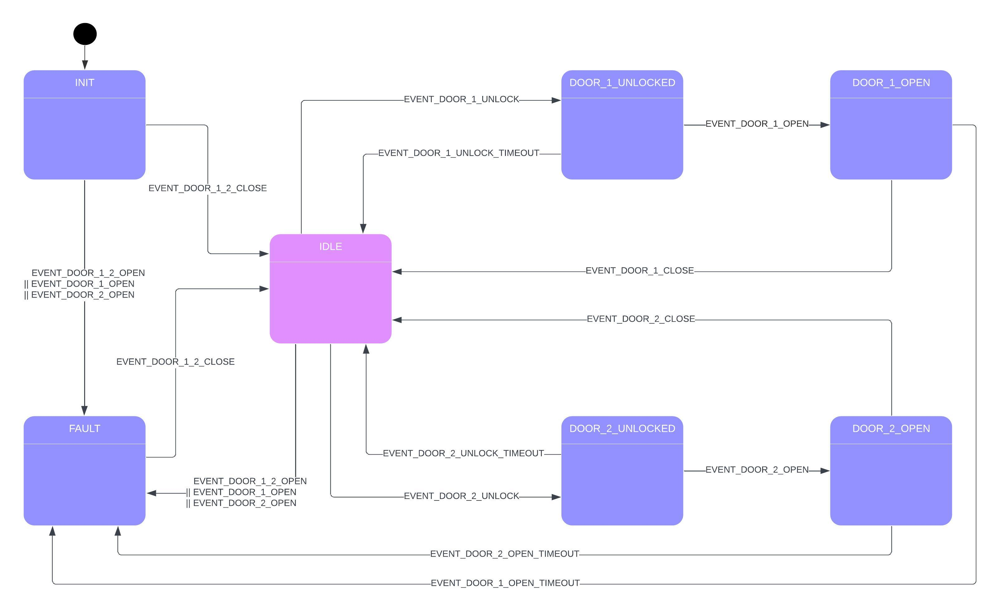

<br><br>

<span style="font-family:Helvetica; font-size:30pt;">Door Control System</span>
---

- [Introduction](#introduction)
  - [How It Works](#how-it-works)
  - [Summary of System Behavior](#summary-of-system-behavior)
    - [Main System States](#main-system-states)
    - [Common Events](#common-events)
    - [What Happens in Case of Errors?](#what-happens-in-case-of-errors)
  - [User Tips](#user-tips)
- [Command Line Interface (CLI)](#command-line-interface-cli)
  - [Installation and Setup](#installation-and-setup)
    - [Step 1: Install Arduino IDE](#step-1-install-arduino-ide)
    - [Step 2: Connect Your Device](#step-2-connect-your-device)
    - [Step 3: Open the Serial Monitor](#step-3-open-the-serial-monitor)
  - [Using the Command Line Interface (CLI)](#using-the-command-line-interface-cli)
    - [1. **info** — Get Software Information](#1-info--get-software-information)
    - [2. **log** — Set Log Level](#2-log--set-log-level)
    - [3. **timer** — Set the Timer](#3-timer--set-the-timer)
    - [4. **dbc** — Set Debounce Time](#4-dbc--set-debounce-time)
    - [5. **inputs** — Get Input State](#5-inputs--get-input-state)
    - [6. **help** — Show Help](#6-help--show-help)
    - [Common Errors](#common-errors)


# Introduction

This Door Control System is designed to control the state of two doors in a way that ensures security and proper operation. The state diagram below outlines how the system moves between different states depending on user actions or events related to the doors.

## How It Works

The system goes through different states based on the status of the doors (whether they are locked, unlocked, open, or closed). These states are triggered by specific events, such as a door being unlocked, opened, or closed. The system uses LEDs to indicate the current state of each door, making it easy to understand what is happening at a glance.

## Summary of System Behavior

1. **Idle** - The system starts by waiting for action. This is indicated by both door leds being white.
2. **Unlock** - The system moves to an "unlocked" state when a door is unlocked. This is indicated by the door led blink in  green (for the open door) and red (for the closed door).
3. **Open** - Once unlocked, if the door is opened, the system moves to an "open" state. his is indicated by the door led blink in  green (for the open door) and red (for the closed door).
4. **Fault** - If something goes wrong (like both doors opening simultaneously), the system moves to a "fault" state. This is indicated by both door leds blinking in magenta.

### Main System States



1. **INIT (Initialization State)**
   The system starts here when it is first turned on. It checks that both doors are initially closed before moving to the next state.

2. **IDLE (Waiting State)**
   Once the doors are closed, the system moves into IDLE, where it waits for further events. From here, the system can respond to several actions, such as unlocking or opening a door.

3. **DOOR_1_UNLOCKED**
   When Door 1 is unlocked, the system transitions to this state. It waits for Door 1 to either open or relock after a timeout.

4. **DOOR_1_OPEN**
   If Door 1 is unlocked and then opened, the system enters this state. Once the door closes, it will return to the IDLE state. If the door remains open for too long, the system will move to a FAULT state.

5. **DOOR_2_UNLOCKED**
   Similar to Door 1, when Door 2 is unlocked, the system moves to this state.  It waits for the door to either open or relock after a timeout.

6. **DOOR_2_OPEN**
   When Door 2 is unlocked and opened, the system transitions here. It will wait for the door to close before returning to the IDLE state. If the door remains open for too long, the system will move to a FAULT state.

7. **FAULT (Error State)**
   If there is an issue, such as both doors being open at the same time, the system moves to the FAULT state. From here, it waits until the issue is resolved (i.e., both doors are closed) before returning to IDLE.

### Common Events

- **EVENT_DOOR_1_UNLOCK / EVENT_DOOR_2_UNLOCK:** These events trigger when either Door 1 or Door 2 is unlocked.
- **EVENT_DOOR_1_OPEN / EVENT_DOOR_2_OPEN:** These events occur when a door is opened.
- **EVENT_DOOR_1_CLOSE / EVENT_DOOR_2_CLOSE:** These events occur when a door is closed.
- **EVENT_DOOR_1_UNLOCK_TIMEOUT / EVENT_DOOR_2_UNLOCK_TIMEOUT:** The system moves back to IDEL state if a door is left unlocked for too long without being opened.
- **EVENT_DOOR_1_OPEN_TIMEOUT / EVENT_DOOR_2_OPEN_TIMEOUT:** If a door is left open for too long, the system moves to FAULT state.

### What Happens in Case of Errors?

If both doors are open at the same time, or if there’s a problem closing the doors, the system will enter the FAULT state. This means there is a potential security issue or malfunction that needs to be resolved. The system will remain in the FAULT state until both doors are properly closed.

## User Tips

- Ensure doors are closed properly to prevent the system from entering the FAULT state.
- The system automatically moves back to IDLE after normal door operations (unlocking and opening).
- In case of issues (FAULT state), check that both doors are closed and wait for the system to return to IDLE.


# Command Line Interface (CLI)

This section will guide you through installing the required software and using the command line interface (CLI) to control the following features of the system. No prior knowledge of computers or IT is required.

1. Log Level
2. Door Unlock Timeout (seconds)
3. Door Open Timeout (minutes)
4. LED Blink Interval (milliseconds)
5. Debounce time for all buttons and switches (milliseconds)

---

## Installation and Setup

### Step 1: Install Arduino IDE

To operate the CLI, you'll need to install the **Arduino IDE**. This software allows you to communicate with the system using a **Serial Monitor**.

Follow these steps to install Arduino IDE:

1. **Download the Arduino IDE:**
   - Visit the official [Arduino website](https://www.arduino.cc/en/software) and download the version for your operating system (Windows, macOS, or Linux).

2. **Install the Arduino IDE:**
   - Once the download is complete, follow the installation steps for your operating system:
     - On **Windows**: Double-click the installer file (`.exe`) and follow the on-screen instructions.
     - On **macOS**: Open the downloaded `.dmg` file and drag the Arduino icon to the Applications folder.
     - On **Linux**: Extract the downloaded archive and follow the installation instructions provided on the Arduino website.

3. **Launch Arduino IDE:**
   - After installation, open the **Arduino IDE** by double-clicking the icon.

---

### Step 2: Connect Your Device

1. **Connect Your Device to the Computer:**
   - Use a USB cable to connect your hardware (UNO R4 Minima board) to your computer. The hardware is where the CLI will run.

2. **Select the Board:**
   - In the Arduino IDE, go to **Tools > Board** and select **UNO R4 Minima** board from the list.

3. **Select the Port:**
   - Go to **Tools > Port** and select the port to which the **UNO R4 Minima** is connected.

---

### Step 3: Open the Serial Monitor

Once the Arduino IDE is set up, the **Serial Monitor** will allow you to interact with the CLI. Follow these steps to open it:

1. **Open the Serial Monitor:**
   - In the Arduino IDE, click on the **magnifying glass** icon in the top right or navigate to **Tools > Serial Monitor**.

2. **Set the Baud Rate:**
   - In the Serial Monitor, set the **baud rate** to be **115200** (this ensures that the system and the Serial Monitor communicate at the same speed).

3. **Select "Newline" Option:**
   - In the Serial Monitor, set the dropdown option to **CR+LF** (Carriage Return + Line Feed). This ensures that the system recognizes the end of each command.

4. **Now you're ready to use the CLI!**
   - You can type commands into the Serial Monitor and see the system's responses.


---

## Using the Command Line Interface (CLI)

The following commands are available. Simply type the command into the Serial Monitor and press **Enter** to execute it.

### 1. **info** — Get Software Information
Use this command to see information about the software.
- **Command:** `info`

**Example:**
```
info
```

**Output:**
```
----------------------------------
Door Control System Information   
----------------------------------
Version: 1.2.3-63-gb36a76e
Build date: Sep 14 2024 15:02:31
Log level: LOG_LEVEL_NOTICE
Door unlock timeout: 30 s
Door open timeout: 18 min
Led blink interval: 180 ms
Debounce delay IO_BUTTON_1: 100 ms
Debounce delay IO_BUTTON_2: 100 ms
Debounce delay IO_SWITCH_1: 100 ms
Debounce delay IO_SWITCH_2: 100 ms
----------------------------------
```


### 2. **log** — Set Log Level
Use this command to set the "log level," which controls the amount of information recorded by the software. The log level can be set to a number between 0 and 6.
- **Command:** `log <level>`

Where `<level>` can be:
- 0: No logs (silent)
- 1: Fatal errors only
- 2: Errors
- 3: Warnings
- 4: Notices
- 5: Trace
- 6: Verbose (this will show all available logs and shall be used for the purpose of debugging/analytics)

**Example: Set log level to 6 (Verbose)**
```
log 6
```

### 3. **timer** — Set the Timer
This command allows you to set different timers that control how the software behaves in certain situations.
- **Command:** `timer -u <unlock timeout> -o <open timeout> -b <blink interval>`

Where:
- `<unlock timeout>` is the time (in seconds) before a door unlocks.
- `<open timeout>` is the time (in minutes) before a door stays open.
- `<blink interval>` is the time (in milliseconds) between LED blinks.

**Example: Set unlock timeout to 5 seconds, open timeout to 2 minutes, and blink interval to 500 milliseconds**
```
timer -u 5 -o 2 -b 500
```

### 4. **dbc** — Set Debounce Time
This command sets the "debounce" time for inputs (such as buttons). Debounce time ensures that accidental multiple presses are ignored.
- **Command:** `dbc -i <input index> -t <debounce time>`

Where:
- `<input index>` is the number of the input (from 0 to 3).
    - 0: Door Button 1
    - 1: Door Button 2
    - 2: Door Switch 1
    - 3: Door Switch 2
- `<debounce time>` is the time (in milliseconds) for which the input should be stable.

**Example: Set debounce time for door button 1 to 200 milliseconds**
```
dbc -i 1 -t 200
```

### 5. **inputs** — Get Input State
This command shows the current state of all inputs (like buttons or switches).
- **Command:** `inputs`

**Example: Get input state for all inputs**
```
inputs
```

### 6. **help** — Show Help
If you need to see all the available commands and what they do, use this command.
- **Command:** `help`

**Example:**
```
help
```

**Output:**
```
Help:
--------------------------------------------
info <...>
Get software information

log <...>
Set the log level: log <level (0..6)>

timer [-u <5>] [-o <600>] [-b <500>]
Set the timer. timer -u <unlock timeout (s)> -o <open timeout (min)> -b <blink interval (ms)>

dbc -i <value> -t <value>
Set the debounce time. dbc -i <input index (0..3)> -t <debounce time (ms)>

inputs <...>
Get the input state of all buttons and switches

help
Show the help
```
---

### Common Errors
If you enter a command incorrectly, the system will display an error message. Double-check your spelling and make sure you include all the necessary arguments (e.g., numbers or letters that go with the command).