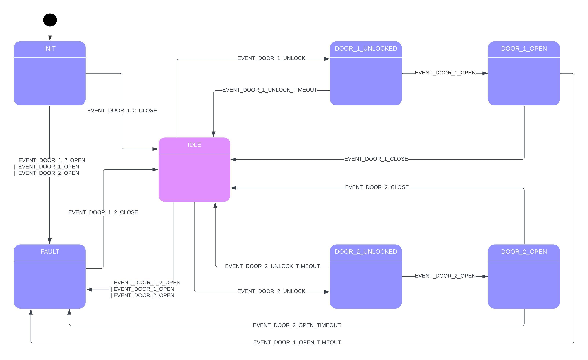
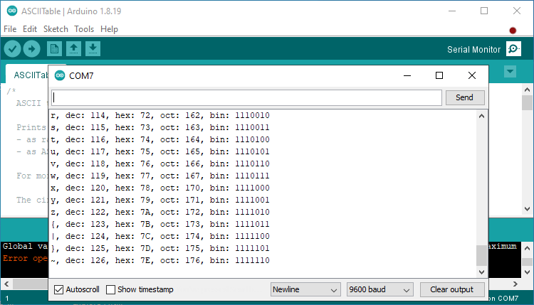

<br><br>

<span style="font-family:Helvetica; font-size:30pt;">Türsteuerungssystem</span>
---

- [Einführung](#einführung)
  - [Funktionsweise](#funktionsweise)
  - [Zusammenfassung des Systemverhaltens](#zusammenfassung-des-systemverhaltens)
    - [Hauptsystemzustände](#hauptsystemzustände)
    - [Häufige Ereignisse](#häufige-ereignisse)
    - [Was passiert im Fehlerfall?](#was-passiert-im-fehlerfall)
  - [Benutzertipps](#benutzertipps)
- [Befehlszeilenschnittstelle (CLI)](#befehlszeilenschnittstelle-cli)
  - [Installation und Einrichtung](#installation-und-einrichtung)
    - [Schritt 1: Arduino IDE installieren](#schritt-1-arduino-ide-installieren)
    - [Schritt 2: Verbinden Sie Ihr Gerät](#schritt-2-verbinden-sie-ihr-gerät)
    - [Schritt 3: Öffnen Sie den seriellen Monitor](#schritt-3-öffnen-sie-den-seriellen-monitor)
  - [Verwenden der Befehlszeilenschnittstelle (CLI)](#verwenden-der-befehlszeilenschnittstelle-cli)
    - [1. **info** – Softwareinformationen abrufen](#1-info--softwareinformationen-abrufen)
    - [2. **log** — Protokoll festlegen Level](#2-log--protokoll-festlegen-level)
    - [3. **timer** – Timer einstellen](#3-timer--timer-einstellen)
    - [4. **dbc** – Entprellzeit einstellen](#4-dbc--entprellzeit-einstellen)
    - [5. **inputs** — Eingangsstatus abrufen](#5-inputs--eingangsstatus-abrufen)
    - [6. **help** — Hilfe anzeigen](#6-help--hilfe-anzeigen)
    - [Häufige Fehler](#häufige-fehler)

# Einführung

Dieses Türsteuerungssystem ist dafür ausgelegt, den Zustand von zwei Türen so zu steuern, dass nur eine Tür zur Zeit geöffnet sein kann. Das folgende Zustandsdiagramm zeigt, wie das System je nach Benutzeraktionen oder Ereignissen im Zusammenhang mit den Türen zwischen verschiedenen Zuständen wechselt.

## Funktionsweise

Das System durchläuft je nach Status der Türen (ob sie verriegelt, entriegelt, offen oder geschlossen sind) verschiedene Zustände. Diese Zustände werden durch bestimmte Ereignisse ausgelöst, z. B. wenn eine Tür entriegelt, geöffnet oder geschlossen wird. Das System verwendet LEDs, um den aktuellen Zustand jeder Tür anzuzeigen, sodass auf einen Blick klar ist, was passiert.

## Zusammenfassung des Systemverhaltens

1. **Leerlauf** – Das System wartet zunächst auf eine Aktion. Dies wird dadurch angezeigt, dass beide Tür-LEDs weiß leuchten.
2. **Entriegeln** – Das System wechselt in den Zustand „entriegelt“, wenn eine Tür entriegelt wird. Dies wird dadurch angezeigt, dass die Tür-LED grün (für die offene Tür) und rot (für die geschlossene Tür) blinkt.
3. **Öffnen** – Sobald die Tür entriegelt ist und geöffnet wird, wechselt das System in den Zustand „offen“. Dies wird dadurch angezeigt, dass die Tür-LED grün (für die offene Tür) und rot (für die geschlossene Tür) blinkt.
4. **Fehler** – Wenn etwas schief geht (z. B. wenn sich beide Türen gleichzeitig öffnen), wechselt das System in den Zustand „Fehler“. Dies wird dadurch angezeigt, dass beide Tür-LEDs magenta blinken.

### Hauptsystemzustände



1. **INIT (Initialisierungszustand)**
Das System startet hier, wenn es zum ersten Mal eingeschaltet wird. Es überprüft, ob beide Türen zunächst geschlossen sind, bevor es in den nächsten Zustand wechselt.

2. **IDLE (Leerlaufzustand)**
Sobald die Türen geschlossen sind, wechselt das System in den IDLE-Zustand, wo es auf weitere Ereignisse wartet. Von hier aus kann das System auf verschiedene Aktionen reagieren, wie z. B. das Entriegeln oder Öffnen einer Tür.

3. **DOOR_1_UNLOCKED (Tür 1 entriegelt)**
Wenn Tür 1 entriegelt wird, wechselt das System in diesen Zustand. Es wartet darauf, dass Tür 1 nach einer Zeitüberschreitung entweder geöffnet oder wieder verriegelt wird.

4. **DOOR_1_OPEN (Tür 1 geöffnet)**
Wenn Tür 1 entriegelt und dann geöffnet wird, wechselt das System in diesen Zustand. Sobald die Tür geschlossen wird, kehrt es in den IDLE-Zustand zurück. Wenn die Tür zu lange offen bleibt, wechselt das System in den FEHLER-Zustand.

5. **DOOR_2_UNLOCKED (Tür 2 entriegelt)**
Ähnlich wie bei Tür 1 wechselt das System in diesen Zustand, wenn Tür 2 entriegelt wird. Es wartet darauf, dass die Tür nach einer Zeitüberschreitung entweder geöffnet oder wieder verriegelt wird.

6. **DOOR_2_OPEN (Tür 2 geöffnet)**
Wenn Tür 2 entriegelt und geöffnet wird, wechselt das System hierher. Es wartet, bis die Tür geschlossen ist, bevor es in den IDLE-Zustand zurückkehrt. Wenn die Tür zu lange geöffnet bleibt, wechselt das System in den FAULT-Zustand.

7. **FAULT (Fehlerzustand)**
Wenn ein Problem vorliegt, z. B. wenn beide Türen gleichzeitig geöffnet sind, wechselt das System in den FAULT-Zustand. Von hier aus wartet es, bis das Problem behoben ist (d. h. beide Türen geschlossen sind), bevor es in den IDLE-Zustand zurückkehrt.

### Häufige Ereignisse

- **EVENT_DOOR_1_UNLOCK / EVENT_DOOR_2_UNLOCK:** Diese Ereignisse werden ausgelöst, wenn entweder Tür 1 oder Tür 2 entriegelt wird.
- **EVENT_DOOR_1_OPEN / EVENT_DOOR_2_OPEN:** Diese Ereignisse treten auf, wenn eine Tür geöffnet wird.
- **EVENT_DOOR_1_CLOSE / EVENT_DOOR_2_CLOSE:** Diese Ereignisse treten auf, wenn eine Tür geschlossen wird.
- **EVENT_DOOR_1_UNLOCK_TIMEOUT / EVENT_DOOR_2_UNLOCK_TIMEOUT:** Das System wechselt zurück in den IDEL-Zustand, wenn eine Tür zu lange unverschlossen bleibt, ohne geöffnet zu werden.
- **EVENT_DOOR_1_OPEN_TIMEOUT / EVENT_DOOR_2_OPEN_TIMEOUT:** Wenn eine Tür zu lange offen bleibt, wechselt das System in den FAULT-Zustand.

### Was passiert im Fehlerfall?

Wenn beide Türen gleichzeitig geöffnet sind oder es ein Problem beim Schließen der Türen gibt, wechselt das System in den FAULT-Zustand. Dies bedeutet, dass ein potenzielles Sicherheitsproblem oder eine Fehlfunktion vorliegt, die behoben werden muss. Das System bleibt im FAULT-Zustand, bis beide Türen richtig geschlossen sind.

## Benutzertipps

- Stellen Sie sicher, dass die Türen richtig geschlossen sind, um zu verhindern, dass das System in den Fehlerzustand wechselt.
- Das System wechselt nach normalen Türvorgängen (Entriegeln und Öffnen) automatisch zurück in den Leerlauf.
- Überprüfen Sie bei Problemen (Fehlerzustand), ob beide Türen geschlossen sind, und warten Sie, bis das System in den Leerlauf zurückkehrt.

# Befehlszeilenschnittstelle (CLI)

Dieser Abschnitt führt Sie durch die Installation der erforderlichen Software und die Verwendung der Befehlszeilenschnittstelle (CLI) zur Steuerung der unten aufgelisteten Systemparamater (mit ihrem Standardwert). Es sind keine Vorkenntnisse in Computern oder IT erforderlich.

- **Protokollebene:** `LOG_LEVEL_NOTICE`
- **Timeout für Türöffnen:** 5 Sekunden
- **Timeout für Türöffnen:** 10 Minuten
- **LED-Blinkintervall:** 500 Millisekunden
- **Entprellverzögerung:**
    - Türknopf 1: 100 Millisekunden
    - Türknopf 2: 100 Millisekunden
    - Türschalter 1: 100 Millisekunden
    - Türschalter 2: 100 Millisekunden

## Installation und Einrichtung

### Schritt 1: Arduino IDE installieren

Um die CLI zu betreiben, müssen Sie die **Arduino IDE** installieren. Diese Software ermöglicht Ihnen die Kommunikation mit dem System über einen **Seriellen Monitor**.

Befolgen Sie diese Schritte, um Arduino IDE zu installieren:

1. **Laden Sie die Arduino IDE herunter:**
- Besuchen Sie die offizielle [Arduino-Website](https://www.arduino.cc/en/software) und laden Sie die Version für Ihr Betriebssystem (Windows, macOS oder Linux) herunter.

2. **Installieren Sie die Arduino IDE:**
- Befolgen Sie nach Abschluss des Downloads die Installationsschritte für Ihr Betriebssystem:
- Unter **Windows**: Doppelklicken Sie auf die Installationsdatei (`.exe`) und folgen Sie den Anweisungen auf dem Bildschirm.
- Unter **macOS**: Öffnen Sie die heruntergeladene `.dmg`-Datei und ziehen Sie das Arduino-Symbol in den Anwendungsordner.
- Unter **Linux**: Extrahieren Sie das heruntergeladene Archiv und folgen Sie den Installationsanweisungen auf der Arduino-Website.

3. **Starten Sie Arduino IDE:**
- Öffnen Sie nach der Installation die **Arduino IDE**, indem Sie auf das Symbol doppelklicken.

---

### Schritt 2: Verbinden Sie Ihr Gerät

1. **Verbinden Sie Ihr Gerät mit dem Computer:**
- Verbinden Sie Ihre Hardware (UNO R4 Minima-Board) über ein USB-Kabel mit Ihrem Computer. Auf der Hardware wird die CLI ausgeführt.

2. **Wählen Sie das Board aus:**
- Gehen Sie in der Arduino IDE zu **Tools > Board** und wählen Sie das **UNO R4 Minima**-Board aus der Liste aus.

3. **Wählen Sie den Port aus:**
- Gehen Sie zu **Tools > Port** und wählen Sie den Port aus, an den das **UNO R4 Minima** angeschlossen ist.

---

### Schritt 3: Öffnen Sie den seriellen Monitor

Sobald die Arduino IDE eingerichtet ist, können Sie über den **Seriellen Monitor** mit der CLI interagieren. Befolgen Sie diese Schritte, um ihn zu öffnen:

1. **Öffnen Sie den seriellen Monitor:**
- Klicken Sie in der Arduino IDE oben rechts auf das **Lupensymbol** oder navigieren Sie zu **Tools > Serieller Monitor**.

2. **Baudrate einstellen:**
- Stellen Sie im seriellen Monitor die **Baudrate** auf **115200** ein (dadurch wird sichergestellt, dass das System und der serielle Monitor mit derselben Geschwindigkeit kommunizieren).

3. **Option „CR+LF“ auswählen:**
- Stellen Sie im seriellen Monitor die Dropdown-Option auf **CR+LF** (Carriage Return + Line Feed). Dadurch wird sichergestellt, dass das System das Ende jedes Befehls erkennt.

4. **Jetzt können Sie die CLI verwenden!**
- Sie können Befehle in den seriellen Monitor eingeben und die Antworten des Systems sehen.



---

## Verwenden der Befehlszeilenschnittstelle (CLI)

Die folgenden Befehle sind verfügbar. Geben Sie den Befehl einfach in den seriellen Monitor ein und drücken Sie die **Eingabetaste**, um ihn auszuführen.

### 1. **info** – Softwareinformationen abrufen
Verwenden Sie diesen Befehl, um Informationen zur Software anzuzeigen.
- **Befehl:** `info`

**Beispiel:**
```
info
```

**Ausgabe:**
```
----------------------------------
Informationen zum Türsteuerungssystem
----------------------------------
Version: 1.2.3-63-gb36a76e
Erstellungsdatum: 14. September 2024 15:02:31
Protokollebene: LOG_LEVEL_NOTICE
Timeout für Türöffnen: 30 s
Timeout für Türöffnen: 18 min
LED-Blinkintervall: 180 ms
Entprellverzögerung IO_BUTTON_1: 100 ms
Entprellverzögerung IO_BUTTON_2: 100 ms
Entprellverzögerung IO_SWITCH_1: 100 ms
Entprellverzögerung IO_SWITCH_2: 100 ms
----------------------------------
```

### 2. **log** — Protokoll festlegen Level
Verwenden Sie diesen Befehl, um das „Log-Level“ einzustellen, das die Menge der von der Software aufgezeichneten Nachrichten steuert. Das Log-Level kann auf eine Zahl zwischen 0 und 6 eingestellt werden.
- **Befehl:** `log <level>`

Wobei `<level>` folgende Werte haben kann:
- 0: Keine Logs (still)
- 1: Nur schwerwiegende Fehler
- 2: Fehler
- 3: Warnungen
- 4: Hinweise
- 5: Trace
- 6: Ausführlich (dadurch werden alle verfügbaren Nachrichten angezeigt und es soll für Debugging-/Analysezwecke verwendet werden)

**Beispiel: Log-Level auf 6 (Ausführlich) einstellen**
```
log 6
```

### 3. **timer** – Timer einstellen
Mit diesem Befehl können Sie verschiedene Timer einstellen, die steuern, wie sich die Software in bestimmten Situationen verhält.
- **Befehl:** `timer -u <Entriegelungs-Timeout> -o <Öffnungs-Timeout> -b <LedBlinkintervall>`

Wobei:
- `<Entriegelungs-Timeout>` die Zeit (in Sekunden) ist, bevor eine Tür entriegelt wird.
- `<Öffnungs-Timeout>` die Zeit (in Minuten) ist, bevor eine Tür offen bleibt.
- `<LedBlinkintervall>` die Zeit (in Millisekunden) in der die LED blinkt, z. B. wenn eine Tür entriegelt ist oder ein Fehler auftritt

**Beispiel: Stellen Sie das Entsperr-Timeout auf 5 Sekunden, das Öffnungs-Timeout auf 2 Minuten und das LED-Blinkintervall auf 500 Millisekunden ein.**
```
timer -u 5 -o 2 -b 500
```

### 4. **dbc** – Entprellzeit einstellen
Dieser Befehl stellt die „Entprellzeit“ für Eingaben (wie Tasten und Schalter) ein. Die Entprellzeit stellt sicher, dass versehentliches Mehrfachdrücken ignoriert wird.
- **Befehl:** `dbc -i <Eingabeindex> -t <Entprellzeit>`

Wobei:
- `<Eingabeindex>` die Nummer der Eingabe ist (von 0 bis 3).
    - `0`: Türtaste 1
    - `1`: Türtaste 2
    - `2`: Türschalter 1
    - `3`: Türschalter 2
- `<Entprellzeit>` die Zeit (in Millisekunden) ist, für die die Eingabe stabil sein soll.

**Beispiel: Entprellzeit für Türknopf 1 auf 200 Millisekunden einstellen**
```
dbc -i 1 -t 200
```

### 5. **inputs** — Eingangsstatus abrufen
Dieser Befehl zeigt den aktuellen Status aller Eingänge (wie Knöpfe oder Schalter) an.
- **Befehl:** `inputs`

**Beispiel: Eingangsstatus für alle Eingänge abrufen**
```
inputs
```

### 6. **help** — Hilfe anzeigen
Wenn Sie alle verfügbaren Befehle und ihre Funktion sehen möchten, verwenden Sie diesen Befehl.
- **Befehl:** `help`

**Beispiel:**
```
help
```

**Ausgabe:**
```
Hilfe:
--------------------------------------------
info <...>
Softwareinformationen abrufen

log <...>
Protokollebene festlegen: log <Ebene (0..6)>

timer [-u <5>] [-o <600>] [-b <500>]
Timer festlegen. timer -u <Timeout für Entsperren (s)> -o <Timeout für Öffnen (min)> -b <Blinkintervall (ms)>

dbc -i <Wert> -t <Wert>
Entprellzeit festlegen. dbc -i <Eingabeindex (0..3)> -t <Entprellzeit (ms)>

Eingaben <...>
Eingabestatus aller Tasten und Schalter abrufen

Hilfe
Hilfe anzeigen
```
---

### Häufige Fehler
Wenn Sie einen Befehl falsch eingeben, zeigt das System eine Fehlermeldung an. Überprüfen Sie Ihre Rechtschreibung und stellen Sie sicher, dass Sie alle erforderlichen Argumente angeben (z. B. Zahlen oder Buchstaben, die zum Befehl gehören).

**Beispiel: Eingabe eines falschen Befehls**
```
I: comLineIf_cmdErrorCb: Befehl unter „fd“ nicht gefunden
I: Verfügbare Befehle:

info <...>
Softwareinformationen abrufen

log <...>
Protokollebene festlegen: log <Ebene (0..6)>

Timer [-u <5>] [-o <600>] [-b <500>]
Timer festlegen. timer -u <Entsperr-Timeout (s)> -o <Öffnungs-Timeout (min)> -b <Blinkintervall (ms)>

dbc -i <Wert> -t <Wert>
Entprellzeit einstellen. dbc -i <Eingabeindex (0..3)> -t <Entprellzeit (ms)>

inputs <...>
Eingabestatus aller Tasten und Schalter abrufen

help
Hilfe anzeigen
```