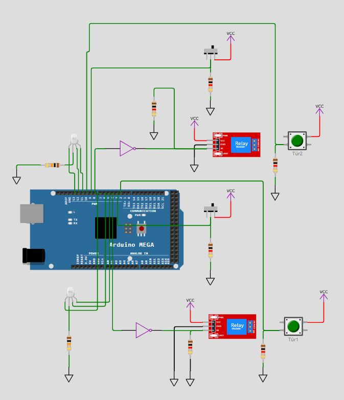
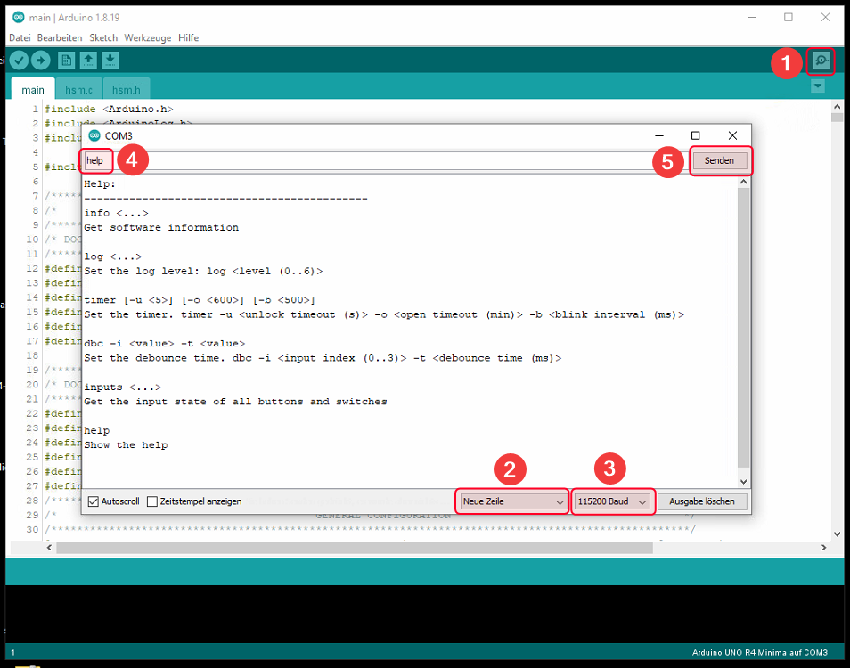
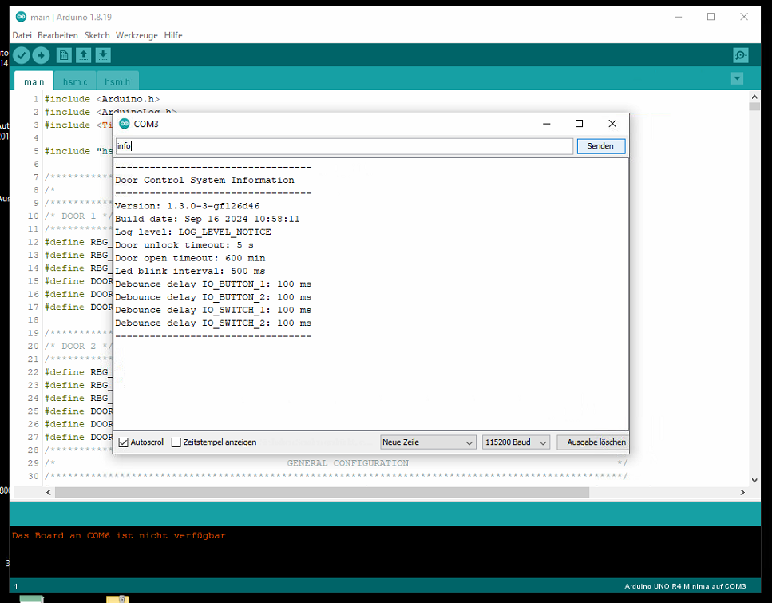
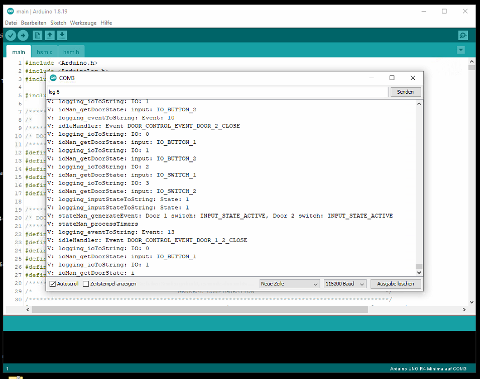
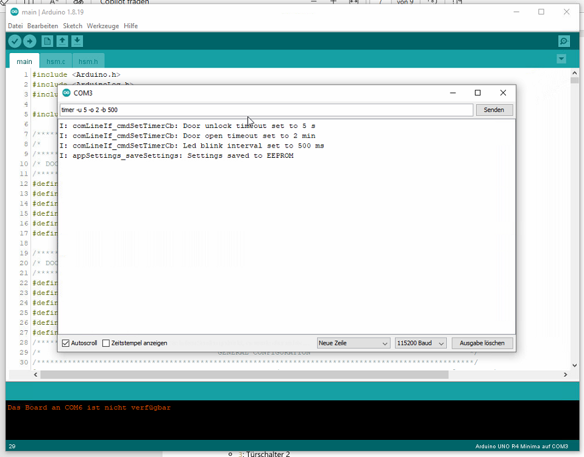
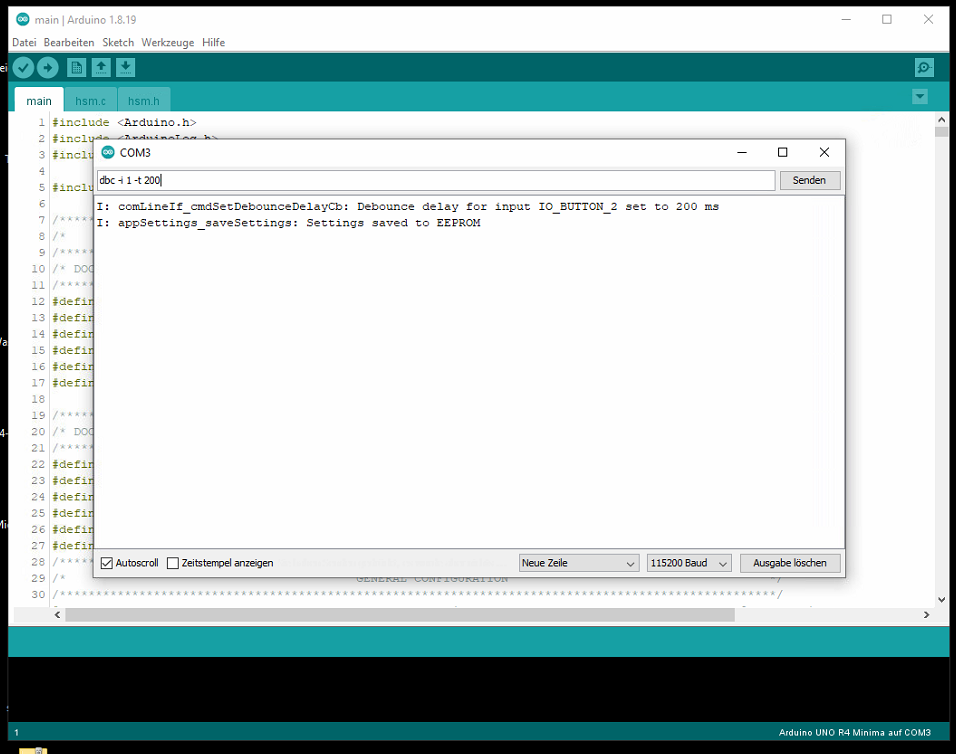
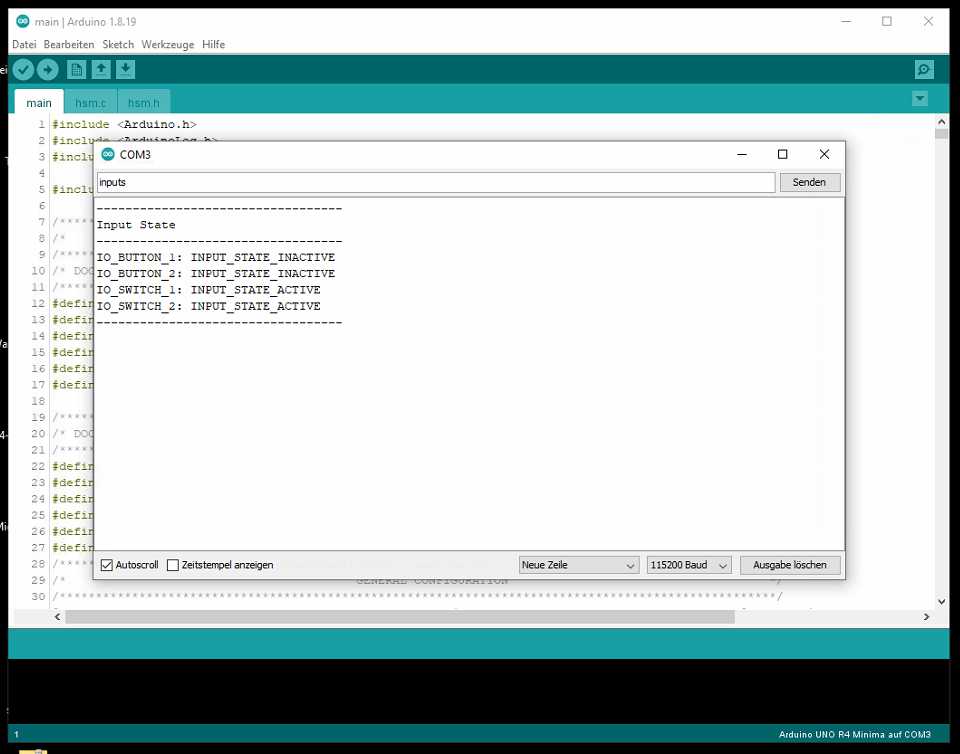
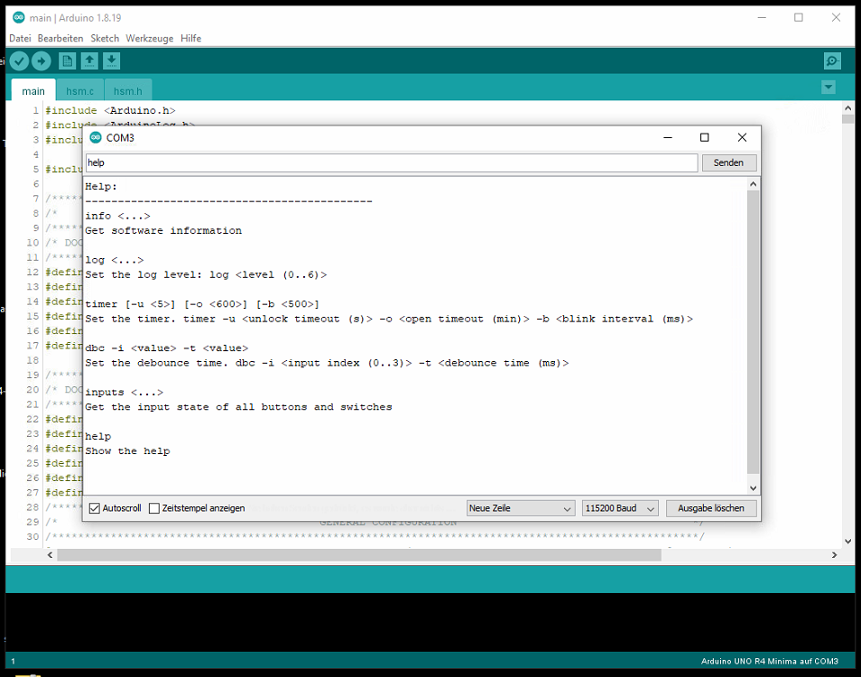
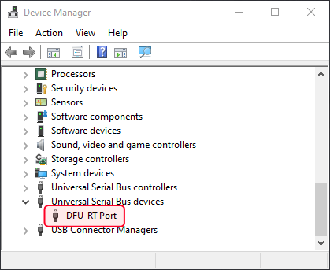
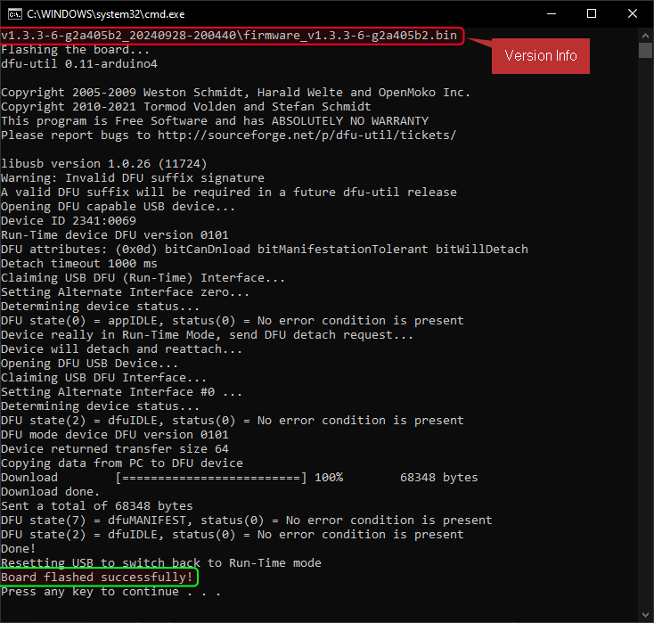

<br><br>

<span style="font-family:Helvetica; font-size:30pt;">Türsteuerungssystem</span>
---

- [Einführung](#einführung)
  - [Funktionsweise](#funktionsweise)
  - [Zusammenfassung des Systemverhaltens](#zusammenfassung-des-systemverhaltens)
    - [Hauptsystemzustände](#hauptsystemzustände)
    - [Häufige Ereignisse](#häufige-ereignisse)
    - [Was passiert im Fehlerfall?](#was-passiert-im-fehlerfall)
  - [Benutzertipps](#benutzertipps)
- [Simulation und Test mit Wokwi](#simulation-und-test-mit-wokwi)
    - [Funktionsweise der Simulation](#funktionsweise-der-simulation)
- [Erläuterung des Simulationsschemas](#erläuterung-des-simulationsschemas)
    - [1. Arduino Mega](#1-arduino-mega)
    - [2. RGB-LEDs](#2-rgb-leds)
    - [3. Druckknöpfe](#3-druckknöpfe)
    - [4. Relais](#4-relais)
    - [5. Schiebeschalter](#5-schiebeschalter)
    - [6. Widerstände](#6-widerstände)
    - [7. NICHT-Gatter](#7-nicht-gatter)
    - [8. Strom- und Masseverbindungen](#8-strom--und-masseverbindungen)
  - [Funktionszusammenfassung](#funktionszusammenfassung)
- [Befehlszeilenschnittstelle (CLI)](#befehlszeilenschnittstelle-cli)
  - [Installation und Einrichtung](#installation-und-einrichtung)
    - [Schritt 1: Arduino IDE installieren](#schritt-1-arduino-ide-installieren)
    - [Schritt 2: Verbinden Sie Ihr Gerät](#schritt-2-verbinden-sie-ihr-gerät)
    - [Schritt 3: Öffnen Sie den seriellen Monitor](#schritt-3-öffnen-sie-den-seriellen-monitor)
  - [Verwenden der Befehlszeilenschnittstelle (CLI)](#verwenden-der-befehlszeilenschnittstelle-cli)
    - [1. **info** – Softwareinformationen abrufen](#1-info--softwareinformationen-abrufen)
    - [2. **log** — Protokoll festlegen Level](#2-log--protokoll-festlegen-level)
    - [3. **timer** – Timer einstellen](#3-timer--timer-einstellen)
    - [4. **dbc** – Entprellzeit einstellen](#4-dbc--entprellzeit-einstellen)
    - [5. **inputs** — Eingangsstatus abrufen](#5-inputs--eingangsstatus-abrufen)
    - [6. **help** — Hilfe anzeigen](#6-help--hilfe-anzeigen)
    - [Häufige Fehler](#häufige-fehler)
- [Persistenz und Speicher](#persistenz-und-speicher)
    - [Funktionsweise](#funktionsweise-1)
    - [Beispiel](#beispiel)
    - [Warum das wichtig ist?](#warum-das-wichtig-ist)
- [Softwareaktualisierung über USB](#softwareaktualisierung-über-usb)
    - [Flash-Anweisungen](#flash-anweisungen)
    - [Warum ein Batch-Skript verwenden?](#warum-ein-batch-skript-verwenden)

# Einführung

Dieses Türsteuerungssystem ist dafür ausgelegt, den Zustand von zwei Türen so zu steuern, dass nur eine Tür zur Zeit geöffnet sein kann. Das folgende Zustandsdiagramm zeigt, wie das System je nach Benutzeraktionen oder Ereignissen im Zusammenhang mit den Türen zwischen verschiedenen Zuständen wechselt.

## Funktionsweise

Das System durchläuft je nach Status der Türen (ob sie verriegelt, entriegelt, offen oder geschlossen sind) verschiedene Zustände. Diese Zustände werden durch bestimmte Ereignisse ausgelöst, z. B. wenn eine Tür entriegelt, geöffnet oder geschlossen wird. Das System verwendet LEDs, um den aktuellen Zustand jeder Tür anzuzeigen, sodass auf einen Blick klar ist, was passiert.

## Zusammenfassung des Systemverhaltens

1. **Leerlauf** – Das System wartet zunächst auf eine Aktion. Dies wird dadurch angezeigt, dass beide Tür-LEDs weiß leuchten.
2. **Entriegeln** – Das System wechselt in den Zustand „entriegelt“, wenn eine Tür entriegelt wird. Dies wird dadurch angezeigt, dass die Tür-LED grün (für die offene Tür) und rot (für die geschlossene Tür) blinkt.
3. **Öffnen** – Sobald die Tür entriegelt ist und geöffnet wird, wechselt das System in den Zustand „offen“. Dies wird dadurch angezeigt, dass die Tür-LED grün (für die offene Tür) und rot (für die geschlossene Tür) blinkt.
4. **Fehler** – Wenn etwas schief geht (z. B. wenn sich beide Türen gleichzeitig öffnen), wechselt das System in den Zustand „Fehler“. Dies wird dadurch angezeigt, dass beide Tür-LEDs magenta blinken.

### Hauptsystemzustände

<div style="text-align: center;">
   
</div>

1. **INIT (Initialisierungszustand)**
Das System startet hier, wenn es zum ersten Mal eingeschaltet wird. Es überprüft, ob beide Türen zunächst geschlossen sind, bevor es in den nächsten Zustand wechselt.

2. **IDLE (Leerlaufzustand)**
Sobald die Türen geschlossen sind, wechselt das System in den IDLE-Zustand, wo es auf weitere Ereignisse wartet. Von hier aus kann das System auf verschiedene Aktionen reagieren, wie z. B. das Entriegeln oder Öffnen einer Tür.

3. **DOOR_1_UNLOCKED (Tür 1 entriegelt)**
Wenn Tür 1 entriegelt wird, wechselt das System in diesen Zustand. Es wartet darauf, dass Tür 1 nach einer Zeitüberschreitung entweder geöffnet oder wieder verriegelt wird.

4. **DOOR_1_OPEN (Tür 1 geöffnet)**
Wenn Tür 1 entriegelt und dann geöffnet wird, wechselt das System in diesen Zustand. Sobald die Tür geschlossen wird, kehrt es in den IDLE-Zustand zurück. Wenn die Tür zu lange offen bleibt, wechselt das System in den FEHLER-Zustand.

5. **DOOR_2_UNLOCKED (Tür 2 entriegelt)**
Ähnlich wie bei Tür 1 wechselt das System in diesen Zustand, wenn Tür 2 entriegelt wird. Es wartet darauf, dass die Tür nach einer Zeitüberschreitung entweder geöffnet oder wieder verriegelt wird.

6. **DOOR_2_OPEN (Tür 2 geöffnet)**
Wenn Tür 2 entriegelt und geöffnet wird, wechselt das System hierher. Es wartet, bis die Tür geschlossen ist, bevor es in den IDLE-Zustand zurückkehrt. Wenn die Tür zu lange geöffnet bleibt, wechselt das System in den FAULT-Zustand.

7. **FAULT (Fehlerzustand)**
Wenn ein Problem vorliegt, z. B. wenn beide Türen gleichzeitig geöffnet sind, wechselt das System in den FAULT-Zustand. Von hier aus wartet es, bis das Problem behoben ist (d. h. beide Türen geschlossen sind), bevor es in den IDLE-Zustand zurückkehrt.

### Häufige Ereignisse

- **EVENT_DOOR_1_UNLOCK / EVENT_DOOR_2_UNLOCK:** Diese Ereignisse werden ausgelöst, wenn entweder Tür 1 oder Tür 2 entriegelt wird.
- **EVENT_DOOR_1_OPEN / EVENT_DOOR_2_OPEN:** Diese Ereignisse treten auf, wenn eine Tür geöffnet wird.
- **EVENT_DOOR_1_CLOSE / EVENT_DOOR_2_CLOSE:** Diese Ereignisse treten auf, wenn eine Tür geschlossen wird.
- **EVENT_DOOR_1_UNLOCK_TIMEOUT / EVENT_DOOR_2_UNLOCK_TIMEOUT:** Das System wechselt zurück in den IDEL-Zustand, wenn eine Tür zu lange unverschlossen bleibt, ohne geöffnet zu werden.
- **EVENT_DOOR_1_OPEN_TIMEOUT / EVENT_DOOR_2_OPEN_TIMEOUT:** Wenn eine Tür zu lange offen bleibt, wechselt das System in den FAULT-Zustand.

### Was passiert im Fehlerfall?

Wenn beide Türen gleichzeitig geöffnet sind oder es ein Problem beim Schließen der Türen gibt, wechselt das System in den FAULT-Zustand. Dies bedeutet, dass ein potenzielles Sicherheitsproblem oder eine Fehlfunktion vorliegt, die behoben werden muss. Das System bleibt im FAULT-Zustand, bis beide Türen richtig geschlossen sind.

## Benutzertipps

- Stellen Sie sicher, dass die Türen richtig geschlossen sind, um zu verhindern, dass das System in den Fehlerzustand wechselt.
- Das System wechselt nach normalen Türvorgängen (Entriegeln und Öffnen) automatisch zurück in den Leerlauf.
- Überprüfen Sie bei Problemen (Fehlerzustand), ob beide Türen geschlossen sind, und warten Sie, bis das System in den Leerlauf zurückkehrt.


# Simulation und Test mit Wokwi

Die Entwicklung und der Test dieser Software wurden mit dem **Wokwi-Simulator** durchgeführt. Wokwi ist eine Online-Plattform, die eine einfache Simulation von Hardwarekomponenten, einschließlich Mikrocontrollern und Sensoren, ermöglicht, die für den Aufbau und Test von Steuerungssystemen wie diesem unerlässlich sind.

### Funktionsweise der Simulation

- **Virtuelle Komponenten**: Im Wokwi-Simulator wurden virtuelle Komponenten wie Tasten, LEDs und Sensoren verwendet, um Türereignisse zu simulieren. Beispielsweise simuliert ein Tastendruck das Öffnen oder Schließen einer Tür.
- **Echtzeittests**: Der Simulator ermöglicht Echtzeittests von Zustandsübergängen ohne physische Hardware. Dies erleichtert das Testen der Softwarelogik und stellt sicher, dass alle Zustände, Ereignisse und Übergänge wie erwartet funktionieren.
- **Debugging**: Wokwi bietet Tools zum Debuggen des Systems und zum Beobachten seines Verhaltens bei verschiedenen Eingaben, wodurch Feinabstimmungen und Verbesserungen der Softwarestabilität möglich sind.

Wenn Sie die Simulation selbst ausprobieren möchten, besuchen Sie einfach [Wokwi - Türsteuerungssystem](https://wokwi.com/projects/404671162937705473), um das Projekt zu laden.

# Erläuterung des Simulationsschemas

Das System besteht aus zwei Türen, die jeweils durch Relais, Tasten, RGB-LEDs und Schalter gesteuert werden, die an einen Arduino Mega angeschlossen sind. Im Folgenden finden Sie eine Aufschlüsselung der einzelnen Komponenten und ihrer Rolle im System.

<div style="text-align: center;">

</div>

### 1. Arduino Mega
  - **ID**: `mega`
    - **Position**: Mitte des Schaltkreises.
    - **Rolle**: Der Arduino Mega fungiert als zentraler Mikrocontroller und verwaltet die Steuerlogik für die Türen, Tasten, RGB-LEDs und Relais. Der Mega steuert die Zustandsübergänge basierend auf den Eingaben von Schaltern und Tasten und gibt Feedback mithilfe der RGB-LEDs.

### 2. RGB-LEDs
  - **RGB1**:
    - **ID**: `rgb1`, beschriftet als „Test“.
    - **Position**: Unten in der Mitte, in der Nähe von Tür 1.
    - **Anschlüsse**: Pins 5 (blau), 6 (grün) und 7 (rot) des Arduino Mega.
    - **Rolle**: Zeigt den Status von Tür 1 an (z. B. verriegelt, entriegelt, offen usw.).

- **RGB2**:
  - **ID**: `rgb2`
    - **Position**: Oben in der Mitte, in der Nähe von Tür 2.
    - **Anschlüsse**: Pins 11 (blau), 12 (grün) und 13 (rot) des Arduino Mega.
    - **Rolle**: Zeigt den Status von Tür 2 ähnlich wie RGB1 an.

### 3. Druckknöpfe
  - **Knopf 1 (Tür1)**:
    - **ID**: `btn1`, beschriftet als "Tür1".
    - **Position**: Unten rechts.
    - **Anschlüsse**: Verbunden mit Pin 2 am Mega.
    - **Rolle**: Simuliert einen Türöffner-/Schließerbefehl für Tür 1.
  
  - **Knopf 2 (Tür2)**:
    - **ID**: `btn2`, beschriftet als "Tür2".
    - **Position**: Oben rechts.
    - **Anschlüsse**: Verbunden mit Pin 10 am Mega.
    - **Rolle**: Simuliert einen Türöffner-/Schließerbefehl für Tür 2.

### 4. Relais
  - **Relais 1**:
    - **ID**: `relay1`
    - **Position**: Oben in der Mitte, neben Tür 2.
    - **Anschlüsse**: Verbunden mit dem NOT-Gate-Ausgang (`not2`), der von Pin 8 des Arduino gesteuert wird.
    - **Rolle**: Steuert den Sperr-/Entsperrzustand von Tür 2 basierend auf dem Signal vom NOT-Gatter.

  - **Relais 2**:
  - **ID**: `relay2`
  - **Position**: Unten in der Mitte, neben Tür 1.
  - **Verbindungen**: Verbunden mit dem NOT-Gatter-Ausgang (`not1`), der von Pin 4 des Arduino gesteuert wird.
  - **Rolle**: Steuert den Sperr-/Entsperrzustand von Tür 1 basierend auf dem Signal vom NOT-Gatter.

### 5. Schiebeschalter
  - **Schalter 1**:
    - **ID**: `sw1`
    - **Position**: Oben links.
    - **Verbindungen**: Verbunden mit Pin 9 des Arduino Mega.
    - **Rolle**: Dieser Schalter ermöglicht eine manuelle Übersteuerung von Tür 1, sodass diese je nach Benutzereingabe geöffnet oder geschlossen bleiben kann.

  - **Schalter 2**:
    - **ID**: `sw2`
    - **Position**: Mitte links.
    - **Verbindungen**: Verbunden mit Pin 3 des Arduino Mega.

    - **Funktion**: Ähnlich wie Schalter 1 ermöglicht dieser Schalter eine manuelle Übersteuerung von Tür 2.

### 6. Widerstände
  - Mehrere Widerstände (`r2`, `r3`, `r4` usw.) werden im gesamten Schaltkreis verwendet, hauptsächlich um den Strom zu begrenzen und die Komponenten zu schützen. Widerstandswerte sind aufgeführt (1000Ω, 10000Ω) und in Reihe mit den Tasten, LEDs und Relais verbunden.

### 7. NICHT-Gatter
  - **NICHT-Gatter 1 (`not1`)**:
    - **ID**: `not1`
    - **Position**: Unten in der Mitte.
    - **Verbindungen**: Empfängt Eingaben von Pin 4 des Mega und gibt sie an Relais 2 aus.
    - **Funktion**: Invertiert das Signal vom Arduino, bevor es an das Relais gesendet wird, und steuert so den Zustand von Tür 1.

- **NICHT-Gate 2 (`not2`)**:
    - **ID**: `not2`
    - **Position**: Oben in der Mitte.
    - **Verbindungen**: Empfängt Eingaben von Pin 8 am Mega und gibt sie an Relais 1 aus.
    - **Funktion**: Invertiert das Signal vom Arduino, bevor es an das Relais gesendet wird, und steuert den Zustand von Tür 2.

### 8. Strom- und Masseverbindungen
  - **VCC und GND**: Im gesamten Schaltkreis werden mehrere VCC- und GND-Verbindungen verwendet, um die Komponenten mit Strom zu versorgen. Komponenten wie der Arduino, Relais, Schalter und RGB-LEDs sind mit VCC (5 V) und GND verbunden, um sicherzustellen, dass sie ordnungsgemäß funktionieren.

## Funktionszusammenfassung

Dieses System steuert zwei Türen (Tür1 und Tür2) mit den folgenden Komponenten:
- **Tasten** zum Öffnen und Schließen der Türen.
- **Relais** zum Ver- und Entriegeln der Türen.
- **RGB-LEDs** zur visuellen Rückmeldung über den Zustand jeder Tür.
- **Schalter** zum manuellen Übersteuern der Türen.
- **NICHT Gatter** zum Invertieren von Signalen, die die Relais steuern (die Relais sind active-low).

Wenn eine Taste gedrückt wird, zeigt die entsprechende RGB-LED den Status der Tür an und das Relais ver- oder entriegelt die Tür. Die Schalter ermöglichen manuelle Übersteuerungen und die Relais werden vom Arduino Mega gesteuert, der Eingaben von den Tasten und Schaltern empfängt und Befehle verarbeitet.

# Befehlszeilenschnittstelle (CLI)

Dieser Abschnitt führt Sie durch die Installation der erforderlichen Software und die Verwendung der Befehlszeilenschnittstelle (CLI) zur Steuerung der unten aufgelisteten Systemparamater (mit ihrem Standardwert). Es sind keine Vorkenntnisse in Computern oder IT erforderlich.

- **Protokollebene:** `LOG_LEVEL_NOTICE`
- **Timeout für Türöffnen:** 5 Sekunden
- **Timeout für Türöffnen:** 10 Minuten
- **LED-Blinkintervall:** 500 Millisekunden
- **Entprellverzögerung:**
    - Türknopf 1: 100 Millisekunden
    - Türknopf 2: 100 Millisekunden
    - Türschalter 1: 100 Millisekunden
    - Türschalter 2: 100 Millisekunden

## Installation und Einrichtung

### Schritt 1: Arduino IDE installieren

Um die CLI zu betreiben, müssen Sie die **Arduino IDE** installieren. Diese Software ermöglicht Ihnen die Kommunikation mit dem System über einen **Seriellen Monitor**.

Befolgen Sie diese Schritte, um Arduino IDE zu installieren:

1. **Laden Sie die Arduino IDE herunter:**
- Besuchen Sie die offizielle [Arduino-Website](https://www.arduino.cc/en/software) und laden Sie die Version für Ihr Betriebssystem (Windows, macOS oder Linux) herunter.

2. **Installieren Sie die Arduino IDE:**
   - Befolgen Sie nach Abschluss des Downloads die Installationsschritte für Ihr Betriebssystem:
     - Unter **Windows**: Doppelklicken Sie auf die Installationsdatei (`.exe`) und folgen Sie den Anweisungen auf dem Bildschirm.
     - Unter **macOS**: Öffnen Sie die heruntergeladene `.dmg`-Datei und ziehen Sie das Arduino-Symbol in den Anwendungsordner.
     - Unter **Linux**: Extrahieren Sie das heruntergeladene Archiv und folgen Sie den Installationsanweisungen auf der Arduino-Website.

3. **Starten Sie Arduino IDE:**
   - Öffnen Sie nach der Installation die **Arduino IDE**, indem Sie auf das Symbol doppelklicken.

### Schritt 2: Verbinden Sie Ihr Gerät

1. **Verbinden Sie Ihr Gerät mit dem Computer:**
   - Verbinden Sie Ihre Hardware (UNO R4 Minima-Board) über ein USB-Kabel mit Ihrem Computer. Auf der Hardware wird die CLI ausgeführt.

2. **Wählen Sie das Board aus:**
   - Gehen Sie in der Arduino IDE zu **Tools > Board** und wählen Sie das **UNO R4 Minima**-Board aus der Liste aus.

3. **Wählen Sie den Port aus:**
   - Gehen Sie zu **Tools > Port** und wählen Sie den Port aus, an den das **UNO R4 Minima** angeschlossen ist.

### Schritt 3: Öffnen Sie den seriellen Monitor

Sobald die Arduino IDE eingerichtet ist, können Sie über den **Seriellen Monitor** mit der CLI interagieren. Befolgen Sie diese Schritte, um ihn zu öffnen:

1. **Öffnen Sie den seriellen Monitor:**
   - Klicken Sie in der Arduino IDE oben rechts auf das **Lupensymbol** oder navigieren Sie zu **Tools > Serieller Monitor**.

2. **Baudrate einstellen:**
   - Stellen Sie im seriellen Monitor die **Baudrate** auf **115200** ein (dadurch wird sichergestellt, dass das System und der serielle Monitor mit derselben Geschwindigkeit kommunizieren).

3. **Option „CR+LF“ auswählen:**
   - Stellen Sie im seriellen Monitor die Dropdown-Option auf **CR+LF** (Carriage Return + Line Feed). Dadurch wird sichergestellt, dass das System das Ende jedes Befehls erkennt.

4. **Jetzt können Sie die CLI verwenden!**
   - Sie können Befehle in den seriellen Monitor eingeben und die Antworten des Systems sehen.

<div style="text-align: center;">
   
</div>


## Verwenden der Befehlszeilenschnittstelle (CLI)

Die folgenden Befehle sind verfügbar. Geben Sie den Befehl einfach in den seriellen Monitor ein und drücken Sie die **Eingabetaste**, um ihn auszuführen.

### 1. **info** – Softwareinformationen abrufen
Verwenden Sie diesen Befehl, um Informationen zur Software anzuzeigen.
- **Befehl:** `info`

**Beispiel:**
```
info
```

**Ausgabe:**
```
----------------------------------
Door Control System Information
----------------------------------
Version: 1.2.3-63-gb36a76e
Build date: Sep 14 2024 15:02:31
Log level: LOG_LEVEL_NOTICE
Door unlock timeout: 30 s
Door open timeout: 18 min
Led blink interval: 180 ms
Debounce delay IO_BUTTON_1: 100 ms
Debounce delay IO_BUTTON_2: 100 ms
Debounce delay IO_SWITCH_1: 100 ms
Debounce delay IO_SWITCH_2: 100 ms
----------------------------------
```

<div style="text-align: center;">
   
</div>

### 2. **log** — Protokoll festlegen Level
Verwenden Sie diesen Befehl, um das „Log-Level“ einzustellen, das die Menge der von der Software aufgezeichneten Nachrichten steuert. Das Log-Level kann auf eine Zahl zwischen 0 und 6 eingestellt werden.
- **Befehl:** `log <level>`

Wobei `<level>` folgende Werte haben kann:
- 0: Keine Logs (still)
- 1: Nur schwerwiegende Fehler
- 2: Fehler
- 3: Warnungen
- 4: Hinweise
- 5: Trace
- 6: Ausführlich (dadurch werden alle verfügbaren Nachrichten angezeigt und es soll für Debugging-/Analysezwecke verwendet werden)

**Beispiel: Log-Level auf 6 (Ausführlich) einstellen**
```
log 6
```

<div style="text-align: center;">
   
</div>

### 3. **timer** – Timer einstellen
Mit diesem Befehl können Sie verschiedene Timer einstellen, die steuern, wie sich die Software in bestimmten Situationen verhält.
- **Befehl:** `timer -u <Entriegelungs-Timeout> -o <Öffnungs-Timeout> -b <LedBlinkintervall>`

Wobei:
- `<Entriegelungs-Timeout>` die Zeit (in Sekunden) ist, bevor eine Tür entriegelt wird.
- `<Öffnungs-Timeout>` die Zeit (in Minuten) ist, bevor eine Tür offen bleibt.
- `<LedBlinkintervall>` die Zeit (in Millisekunden) in der die LED blinkt, z. B. wenn eine Tür entriegelt ist oder ein Fehler auftritt

**Beispiel: Stellen Sie das Entsperr-Timeout auf 5 Sekunden, das Öffnungs-Timeout auf 2 Minuten und das LED-Blinkintervall auf 500 Millisekunden ein.**

```
timer -u 5 -o 2 -b 500
```

<div style="text-align: center;">
   
</div>

### 4. **dbc** – Entprellzeit einstellen
Dieser Befehl stellt die „Entprellzeit“ für Eingaben (wie Tasten und Schalter) ein. Die Entprellzeit stellt sicher, dass versehentliches Mehrfachdrücken ignoriert wird.
- **Befehl:** `dbc -i <Eingabeindex> -t <Entprellzeit>`

Wobei:
- `<Eingabeindex>` die Nummer der Eingabe ist (von 0 bis 3).
    - `0`: Türtaste 1
    - `1`: Türtaste 2
    - `2`: Türschalter 1
    - `3`: Türschalter 2
- `<Entprellzeit>` die Zeit (in Millisekunden) ist, für die die Eingabe stabil sein soll.

**Beispiel: Entprellzeit für Türknopf 1 auf 200 Millisekunden einstellen**

```
dbc -i 1 -t 200
```

<div style="text-align: center;">
   
</div>

### 5. **inputs** — Eingangsstatus abrufen
Dieser Befehl zeigt den aktuellen Status aller Eingänge (wie Knöpfe oder Schalter) an.
- **Befehl:** `inputs`

**Beispiel: Eingangsstatus für alle Eingänge abrufen**

```
inputs
```

<div style="text-align: center;">
   
</div>

### 6. **help** — Hilfe anzeigen
Wenn Sie alle verfügbaren Befehle und ihre Funktion sehen möchten, verwenden Sie diesen Befehl.
- **Befehl:** `help`

**Beispiel:**
```
help
```

**Ausgabe:**
```
Hilfe:
--------------------------------------------
info <...>
Softwareinformationen abrufen

log <...>
Protokollebene festlegen: log <Ebene (0..6)>

timer [-u <5>] [-o <600>] [-b <500>]
Timer festlegen. timer -u <Timeout für Entsperren (s)> -o <Timeout für Öffnen (min)> -b <Blinkintervall (ms)>

dbc -i <Wert> -t <Wert>
Entprellzeit festlegen. dbc -i <Eingabeindex (0..3)> -t <Entprellzeit (ms)>

Eingaben <...>
Eingabestatus aller Tasten und Schalter abrufen

Hilfe
Hilfe anzeigen

```
<div style="text-align: center;">
   
</div>

### Häufige Fehler
Wenn Sie einen Befehl falsch eingeben, zeigt das System eine Fehlermeldung an. Überprüfen Sie Ihre Rechtschreibung und stellen Sie sicher, dass Sie alle erforderlichen Argumente angeben (z. B. Zahlen oder Buchstaben, die zum Befehl gehören).

**Beispiel: Eingabe eines falschen Befehls**
```
I: comLineIf_cmdErrorCb: Command not found at 'fd'
I: Available commands:

info <...>
Get software information

log <...>
Set the log level: log <level (0..6)>

timer [-u <5>] [-o <600>] [-b <500>]
Set the timer. timer -u <unlock timeout (s)> -o <open timeout (min)> -b <blink interval (ms)>

dbc -i <value> -t <value>
Set the debounce time. dbc -i <input index (0..3)> -t <debounce time (ms)>

inputs <...>
Get the input state of all buttons and switches

help
Show the help
```

# Persistenz und Speicher

Um sicherzustellen, dass die Systemeinstellungen zwischen den Einschaltzyklen erhalten bleiben, verwendet das Türsteuerungssystem **EEPROM** (elektrisch löschbarer programmierbarer Nur-Lese-Speicher) zum Speichern der Konfigurationseinstellungen. Dieser Persistenzmechanismus stellt sicher, dass alle über die Befehlszeilenschnittstelle (CLI) vorgenommenen Änderungen nicht verloren gehen, wenn das System neu gestartet oder ausgeschaltet wird.

### Funktionsweise

- **Einstellungen speichern**: Wenn eine Einstellung über die CLI geändert wird, speichert das System die neue Einstellung automatisch im internen EEPROM. Dadurch wird sichergestellt, dass die neue Konfiguration auch nach dem Neustart des Systems erhalten bleibt.

- **Einstellungen laden**: Bei jedem Systemstart (oder Neustart) überprüft das System, ob Einstellungen im EEPROM gespeichert wurden. Wenn Einstellungen vorhanden sind, werden sie automatisch geladen, wodurch sichergestellt wird, dass das System mit derselben Konfiguration wie vor dem Neustart fortgesetzt wird.

### Beispiel

- **Szenario**: Wenn Sie Tür 1 öffnen/scgließen und feststellen, dass die Entprellzeit für Türschalter 1 unpassend ist, können Sie die Diese über die CLI anpassen. Der neue Wert wird dabei automatisch im EEPROM gespeichert.
- **Nächster Start**: Wenn das System neu gestartet wird, wird der angepasste Zeitlimitwert geladen, sodass Sie es nicht manuell neu konfigurieren müssen.

### Warum das wichtig ist?

Durch die Verwendung von EEPROM kann das System **vor Ort konfiguriert und feinabgestimmt werden, ohne dass eine Neuprogrammierung erforderlich ist**. Das bedeutet, dass Techniker oder Bediener die Systemeinstellungen (wie Türzeitlimitwerte, Verhalten nach dem Öffnen usw.) direkt über die CLI einfach anpassen können. Sobald diese Einstellungen im EEPROM gespeichert sind, behält das System sie auch nach einem Neustart bei, wodurch es sich sehr gut an unterschiedliche Umgebungen oder Anforderungen anpassen lässt.

Dadurch entfällt die Notwendigkeit, den Code zu ändern oder das System neu zu flashen, wenn Betriebsänderungen erforderlich sind. Dadurch werden Wartung, Konfiguration und Systemaktualisierungen schneller und bequemer, was Ausfallzeiten und technischen Aufwand erheblich reduziert.

# Softwareaktualisierung über USB

Das Flashen des Türsteuerungssystems auf die Hardware kann über USB mithilfe eines einfachen Batch-Skripts erfolgen, das vom Softwareteam/Eigentümer bereitgestellt wird. Dieses Skript automatisiert den Prozess des Ladens der kompilierten Firmware auf die Platine, sodass das System schnell und einfach aktualisiert werden kann, ohne dass detaillierte Kenntnisse der zugrunde liegenden Programmierung erforderlich sind.

### Flash-Anweisungen

1. **Softwareversion erhalten**: Sie erhalten vom Softwareteam ein Softwareversionspaket mit dem Namen `v1.2.3-0-g1a2b3c4_20241224_121212.zip`. Dieses Paket enthält die folgenden Elemente:
   - `firmware_v1.2.3-0-g1a2b3c4.bin`: Kompilierte Firmware-Binärdatei für das Türsteuerungssystem.
   - `program_board.bat`: Batch-Skriptdatei zum Flashen der Firmware auf die Platine über USB.
   - `platformio.ini`: Die plattformspezifische Konfigurationsdatei, die vom Batch-Skript benötigt wird.
   - `README_de/en.pdf`: Softwaredokumentation / Bedienungsanleitung in Englisch und Deutsch.

2. **Board anschließen**: Schließen Sie das Hardwareboard über ein USB-Kabel an Ihren Computer an. Stellen Sie sicher, dass das Board eingeschaltet und von Ihrem Computer erkannt wird so wie unten dargestellt. Für den Fall, dass Board nicht erkannt wird, installieren Sie die erforderlichen Treiber `renesas_drivers.zip` aus dem Release-Paket.

<div style="text-align: center;">
   
</div>

3. **Batch-Skript ausführen**:
   - Extrahieren Sie den Inhalt des Release-Pakets in einen Ordner auf Ihrem Computer.
   - Suchen Sie das Skript `program_board.bat` im extrahierten Ordner.
   - Doppelklicken Sie auf die Batch-Datei, um sie auszuführen.
   - Das Skript findet automatisch den richtigen Port, lädt die Firmware hoch und flasht das Board.

3. **Warten Sie, bis das Flashen abgeschlossen ist**: Das Skript zeigt im Terminalfenster Fortschrittsinformationen an, die angeben, wann der Flashvorgang beginnt und endet. Nach Abschluss ist das System mit der neu geflashten Firmware einsatzbereit so wie unten dargestellt.

<div style="text-align: center;">
   
</div>

4. **Softwareversion überprüfen**:
   - Stellen Sie nach dem Flashen eine Verbindung zur Befehlszeilenschnittstelle (CLI) des Systems her.
   - Führen Sie den Befehl `info` aus, um die aktuelle Softwareversion anzuzeigen.
   - Vergleichen Sie die angezeigte Version mit der vom Softwareteam bereitgestellten Version, um sicherzustellen, dass die richtige Firmware installiert wurde.

    **Beispielausgabe:**
    ```
    ----------------------------------
    Informationen zum Türsteuerungssystem
    ----------------------------------
    Version: 1.2.3-0-g1a2b3c4
    Erstellungsdatum: 14. September 2024 15:02:31
    Protokollebene: LOG_LEVEL_NOTICE
    Timeout für Tür öffnen: 30 s
    Timeout für Tür öffnen: 18 min
    LED-Blinkintervall: 180 ms
    Entprellverzögerung IO_BUTTON_1: 100 ms
    Entprellverzögerung IO_BUTTON_2: 100 ms
    Entprellverzögerung IO_SWITCH_1: 100 ms
    Entprellverzögerung IO_SWITCH_2: 100 ms
    ----------------------------------
    ```

Wenn die angezeigte Version nicht mit der erwarteten Version übereinstimmt, versuchen Sie, die Karte neu zu flashen, oder wenden Sie sich an das Softwareteam, um Hilfe zu erhalten.

### Warum ein Batch-Skript verwenden?

- **Benutzerfreundlichkeit**: Das Batch-Skript abstrahiert die gesamte technische Komplexität und ermöglicht es technisch nicht versierten Benutzern, das System mit minimalem Aufwand zu aktualisieren.
- **Schnelle Updates**: Firmware-Updates können schnell angewendet werden, was Feldaktualisierungen oder schnelle Tests erleichtert.
- **Keine zusätzlichen Tools erforderlich**: Das Batch-Skript übernimmt alle erforderlichen Schritte, sodass Sie zum Flashen der Karte keine zusätzlichen Tools oder Software installieren oder verwenden müssen.